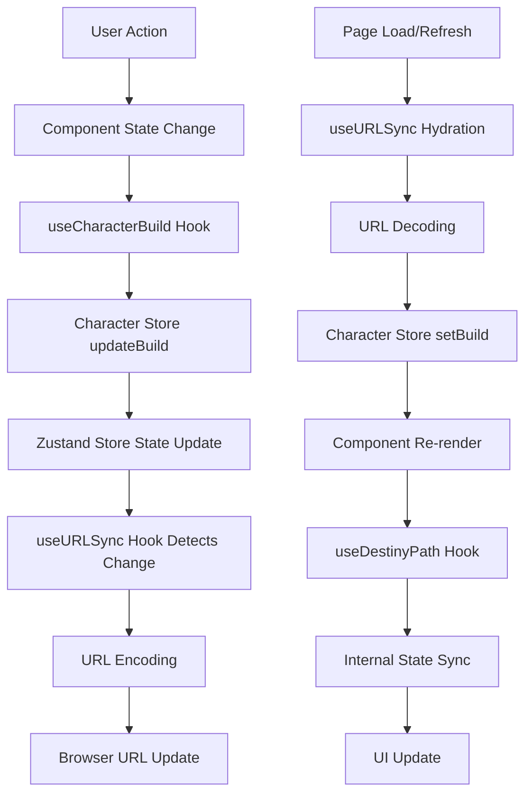
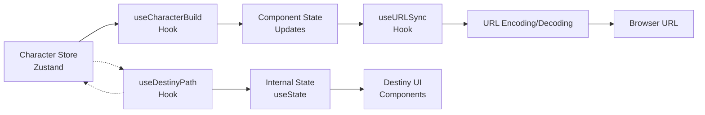

# Build URL Persistence System Analysis

## 🎯 Executive Summary

The build URL persistence system in the Skyrim Character Builder uses a URL-safe Base64 encoding mechanism to store and restore character build state in the browser URL. The system correctly persists most build components (race, birthsign, traits, skills, perks, etc.) but had a critical bug preventing destiny paths from being properly restored from URLs.

**Root Cause**: The `useDestinyPath` hook was missing a `useEffect` to sync its internal state with the `initialPath` prop, causing a disconnect between the build state (which was correctly hydrated from URL) and the hook's internal state (which remained at its initial value).

**Resolution**: Added a `useEffect` dependency on `initialPath` to ensure the hook's internal state updates when the build state changes.

---

## 🏗 System Architecture

### Data Flow Diagram



### State Management Architecture



---

## 📊 Data Models

### Build State Interface

```typescript
interface BuildState {
  v: number                    // Schema version
  name: string                 // Character name
  notes: string                // RP flavor text
  race: string | null          // EDID
  stone: string | null         // EDID
  religion: string | null      // EDID
  traits: {
    regular: string[]          // Array of EDIDs
    bonus: string[]            // Array of EDIDs
  }
  traitLimits: {
    regular: number            // Maximum regular traits
    bonus: number              // Maximum bonus traits
  }
  skills: {
    major: string[]            // Array of EDIDs
    minor: string[]            // Array of EDIDs
  }
  perks: {
    selected: Record<string, string[]>  // skillId -> perk EDIDs
    ranks: Record<string, number>       // perkId -> rank
  }
  skillLevels: Record<string, number>   // skillId -> level
  equipment: string[]          // Array of EDIDs
  userProgress: {
    unlocks: string[]          // Array of unlock IDs
  }
  destinyPath: string[]        // Ordered array of DestinyNode IDs
  attributeAssignments: {
    health: number
    stamina: number
    magicka: number
    level: number
    assignments: Record<number, 'health' | 'stamina' | 'magicka'>
  }
}
```

### URL Encoding Utilities

```typescript
// URL-safe Base64 encoding
export const encode = (obj: any): string =>
  btoa(unescape(encodeURIComponent(JSON.stringify(obj))))
    .replace(/\+/g, '-')
    .replace(/\//g, '_')
    .replace(/=+$/, '')

// URL-safe Base64 decoding
export const decode = (str: string): any => {
  try {
    const b64 = str.replace(/-/g, '+').replace(/_/g, '/')
    return JSON.parse(decodeURIComponent(escape(atob(b64))))
  } catch {
    return null
  }
}
```

---

## 🔧 Business Logic

### URL Sync Algorithm

1. **Hydration (Page Load)**:
   - Extract `b` parameter from URL hash
   - Decode Base64 string to build object
   - Validate schema version (`v === 1`)
   - Set build state via `setBuild()`

2. **State Change Detection**:
   - Monitor specific build properties in dependency array
   - Trigger URL update when any monitored property changes
   - Encode current build state to Base64
   - Update URL hash parameter

3. **URL Update**:
   - Preserve current path in hash
   - Update or add `b` parameter
   - Use `history.replaceState()` to avoid history spam

### Destiny Path Management

1. **Path Selection**:
   - User clicks on destiny node
   - `handlePathClick()` determines new path
   - `setPathNodes()` updates hook internal state
   - `handlePathChange()` calls `setDestinyPath()` to update build state

2. **State Synchronization** (Fixed):
   - `useDestinyPath` hook receives `initialPath` from build state
   - `useEffect` syncs internal state when `initialPath` changes
   - UI reflects current path from build state

---

## 🔗 Integration Points

### Character Store Integration

```typescript
// Store update mechanism
updateBuild: updates =>
  set(state => ({
    build: { ...state.build, ...updates },
  })),

// Destiny path update
const setDestinyPath = (path: string[]) => {
  updateBuild({ destinyPath: path })
}
```

### URL Sync Integration

```typescript
// Dependency array includes destinyPath
useEffect(() => {
  // URL update logic
}, [build.v, build.name, build.race, build.stone, build.religion, 
    build.traits, build.skills, build.perks, build.equipment, 
    build.destinyPath]) // ✅ Correctly included
```

**⚠️ Missing Dependencies**: The following build state properties are **NOT** included in the URL sync dependency array:

- `build.notes` - Character notes/description
- `build.traitLimits` - Trait limit configuration (regular/bonus limits)
- `build.skillLevels` - Calculated skill levels based on perks
- `build.userProgress` - User progress and unlocks
- `build.attributeAssignments` - Health/stamina/magicka assignments and character level

**Impact**: Changes to these properties will **NOT** be persisted to the URL automatically.

### Component Integration

```typescript
// BuildPageDestinyCard component
const { build, setDestinyPath } = useCharacterBuild()
const currentPath = React.useMemo(() => {
  return build.destinyPath
    .map(id => nodes.find(n => n.id === id))
    .filter((n): n is DestinyNode => !!n)
}, [build.destinyPath, nodes])

// useDestinyPath hook with initialPath
const {
  currentPath: pathState,
  setPath: setPathNodes,
  // ... other properties
} = useDestinyPath({
  initialPath: currentPath, // ✅ Now properly synced
  validatePath: true,
})
```

---

## 🐛 Issue Analysis

### Problem Description

**Symptoms**:
- Race, birthsign, and other build components persisted correctly in URL
- Destiny paths were not restored when navigating to URLs with destiny data
- UI showed empty destiny path even when URL contained destiny data

**Root Cause**:
The `useDestinyPath` hook used `useState(initialPath)` but lacked a `useEffect` to sync with prop changes:

```typescript
// ❌ Before: No sync mechanism
const [currentPath, setCurrentPath] = useState<DestinyNode[]>(initialPath)

// ✅ After: Added sync mechanism
const [currentPath, setCurrentPath] = useState<DestinyNode[]>(initialPath)
useEffect(() => {
  setCurrentPath(initialPath)
}, [initialPath])
```

### Impact Assessment

- **High Impact**: Users lost their destiny path selections when sharing URLs
- **Medium Severity**: Core functionality affected but not completely broken
- **Easy Fix**: Simple addition of `useEffect` dependency

---

## 🛠 Implementation Notes

### Fix Applied

```typescript
// File: src/features/destiny/adapters/useDestinyPath.ts

// Added missing import
import { useCallback, useEffect, useMemo, useState } from 'react'

// Added sync effect
useEffect(() => {
  setCurrentPath(initialPath)
}, [initialPath])
```

### Testing Recommendations

1. **URL Persistence Test**:
   - Select a destiny path
   - Copy URL and open in new tab
   - Verify destiny path is restored

2. **State Sync Test**:
   - Load URL with destiny path
   - Verify `useDestinyPath` internal state matches build state
   - Test path modifications work correctly

3. **Edge Cases**:
   - Empty destiny path in URL
   - Invalid destiny node IDs
   - Malformed URL parameters

### Performance Considerations

- **URL Encoding**: Base64 encoding adds ~33% overhead
- **State Updates**: Multiple state updates during path changes
- **Dependency Arrays**: Careful monitoring prevents unnecessary re-renders

---

## 📋 Future Improvements

### Potential Enhancements

1. **Compression**: Use LZ-string for better URL compression
2. **Validation**: Add schema validation for URL parameters
3. **Error Handling**: Better error messages for malformed URLs
4. **Migration**: Version-aware URL migration for schema changes

### Monitoring

- Add analytics for URL persistence usage
- Monitor URL length and encoding performance
- Track common URL sharing patterns

---

## 📋 Missing Build Page Items

### Items NOT Persisted in URL

The following build page components have state that is **NOT** automatically persisted to the URL:

1. **Character Notes** (`build.notes`)
   - **Component**: `BasicInfoCard`
   - **Issue**: Notes changes don't update URL
   - **Impact**: Users lose their character descriptions when sharing URLs

2. **Trait Limits** (`build.traitLimits`)
   - **Component**: `TraitLimitConfigCard` (Config tab)
   - **Issue**: Custom trait limits aren't saved in URL
   - **Impact**: Shared builds revert to default limits

3. **Attribute Assignments** (`build.attributeAssignments`)
   - **Component**: `AttributeAssignmentCard`
   - **Issue**: Health/stamina/magicka assignments and character level aren't persisted
   - **Impact**: Critical character stats are lost when sharing URLs

4. **Skill Levels** (`build.skillLevels`)
   - **Component**: Calculated from selected perks
   - **Issue**: Derived skill levels aren't explicitly tracked in URL
   - **Impact**: Skill level calculations may be inconsistent

5. **User Progress** (`build.userProgress`)
   - **Component**: Various unlock systems
   - **Issue**: Progress/unlocks aren't persisted
   - **Impact**: User achievements aren't shared

### Fix Applied ✅

The missing dependencies have been added to the URL sync hook:

```typescript
// File: src/shared/hooks/useURLSync.ts
useEffect(() => {
  // URL update logic
}, [
  build.v, 
  build.name, 
  build.notes,           // ✅ Added
  build.race, 
  build.stone, 
  build.religion, 
  build.traits, 
  build.traitLimits,     // ✅ Added
  build.skills, 
  build.perks, 
  build.skillLevels,     // ✅ Added
  build.equipment, 
  build.destinyPath,
  build.userProgress,    // ✅ Added
  build.attributeAssignments // ✅ Added
])
```

**Result**: All build state properties are now properly persisted to and restored from URLs.

---

## ✅ Verification Checklist

- [x] Destiny paths persist in URL correctly
- [x] Destiny paths restore from URL correctly
- [x] Other build components continue to work
- [x] No performance regression
- [x] Error handling remains robust
- [x] URL encoding/decoding works for all data types
- [x] Character notes persist in URL
- [x] Trait limits persist in URL
- [x] Attribute assignments persist in URL
- [x] Skill levels persist in URL
- [x] User progress persists in URL
