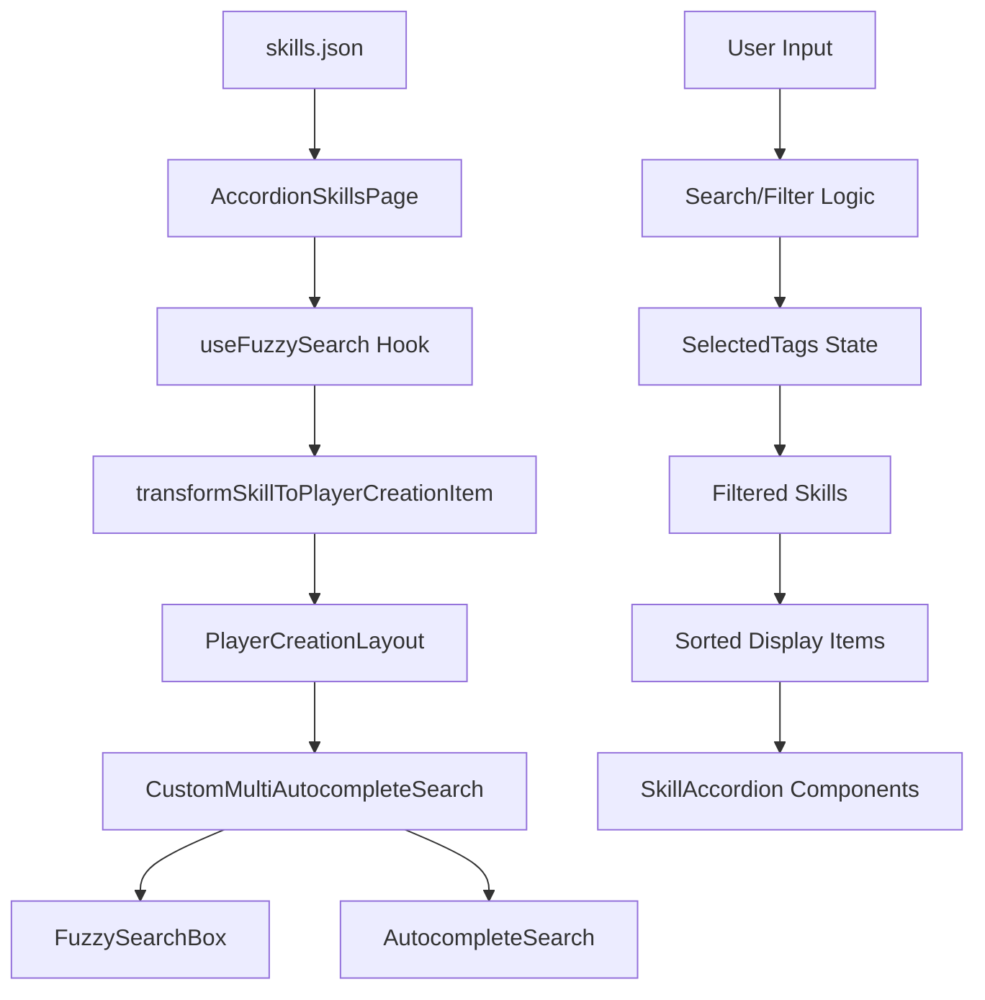

# Skills Feature Documentation

## 📋 Feature Overview

### Purpose

The Skills feature provides a comprehensive interface for exploring and managing character skills in the Skyrim-themed Lorerim Arcaneum application. It enables users to browse, search, filter, and select skills for their character builds with advanced search capabilities and detailed skill information display.

### Core Functionality

- **Skill Browsing**: Comprehensive accordion-based skill display with expandable details
- **Advanced Search**: Multi-category autocomplete search with fuzzy text matching
- **Smart Filtering**: Category-based and tag-based filtering with visual tag management
- **Build Integration**: Direct integration with character build system via "Add to Build" functionality
- **Customizable Display**: User-configurable visibility controls for scaling, abilities, and tags
- **Sorting Options**: Multiple sorting algorithms (alphabetical, category, ability count)

### Data Structure

Primary data interfaces used by the feature:

```typescript
interface Skill {
  name: string
  edid: string
  category: string
  description: string
  scaling: string
  keyAbilities: string[]
  metaTags: string[]
  abbreviation?: string
}

interface PlayerCreationItem {
  id: string
  name: string
  description: string
  category: string
  tags: string[]
  effects: Array<{
    type: 'positive' | 'negative'
    name: string
    description: string
    target: string
  }>
}
```

---

## 🏗️ Component Architecture

### Component Tree

Visual representation of the component hierarchy:

```
AccordionSkillsPage
├── PlayerCreationLayout (shared)
│   ├── CustomMultiAutocompleteSearch
│   │   ├── FuzzySearchBox
│   │   └── AutocompleteSearch (shared)
│   ├── SelectedTags Display
│   ├── Controls Section
│   │   ├── Sort Dropdown
│   │   ├── Expand/Collapse All
│   │   └── Customize Display Accordion
│   └── SkillAccordion List
│       └── GenericAccordionCard (shared)
│           ├── AddToBuildSwitchSimple (shared)
│           └── Accordion Content Sections
└── Loading/Error States
```

### Component Responsibilities

#### **AccordionSkillsPage** (`pages/AccordionSkillsPage.tsx`)

- **Purpose**: Primary orchestrator and data manager for skills feature
- **Key Functions**:
  - Data fetching from `public/data/skills.json`
  - State management for filters, sorting, and display preferences
  - Search category generation and tag management
  - Error handling and loading states
  - Integration with shared PlayerCreationLayout

#### **CustomMultiAutocompleteSearch** (`components/CustomMultiAutocompleteSearch.tsx`)

- **Purpose**: Orchestrates multiple search interfaces
- **Features**:
  - Combines fuzzy search box with category-specific autocomplete
  - Responsive layout with flexible sizing
  - Unified selection handling for all search types

#### **FuzzySearchBox** (`components/FuzzySearchBox.tsx`)

- **Purpose**: Advanced text search with custom query support
- **Features**:
  - Real-time fuzzy matching across multiple fields
  - Custom search term addition capability
  - Keyboard navigation and accessibility
  - Category selection interface

#### **SkillAccordion** (`components/SkillAccordion.tsx`)

- **Purpose**: Individual skill display with expandable details
- **Features**:
  - Visual category indicators with color coding
  - Configurable content sections (scaling, abilities, tags)
  - Integration with build system
  - Responsive design with proper spacing

---

## 🔧 Technical Design

### Data Flow Architecture



### State Management

1. **Local State** (Component-specific):
   - `skills`: Raw skills data from JSON
   - `loading`: Data fetching state
   - `error`: Error handling state
   - `expandedSkills`: Set of expanded accordion IDs
   - `sortBy`: Current sorting algorithm
   - `showScaling/showAbilities/showTags`: Display preferences

2. **Shared State** (Hooks):
   - `selectedTags`: Active filter tags with categories
   - `filteredSkills`: Computed filtered results
   - `fuzzySearchQuery`: Text search query

### Data Transformation

**Source Format** (skills.json):

```typescript
{
  skills: Array<{
    name: string
    edid: string
    category: string
    description: string
    scaling: string
    keyAbilities: string[]
    metaTags: string[]
    abbreviation?: string
  }>
}
```

**Target Format** (PlayerCreationItem):

```typescript
{
  id: string // normalized name
  name: string
  description: string
  category: string
  tags: string[] // metaTags + category
  effects: Array<{
    type: 'positive'
    name: string
    description: string
    target: string
  }>
}
```

### Search & Filtering System

#### Search Categories

- **Fuzzy Search**: Text-based search across name, description, abilities, and tags
- **Skill Categories**: Filter by Combat, Magic, Stealth categories
- **Meta Tags**: Filter by skill-specific tags and keywords

#### Filter Logic

```typescript
// Multi-stage filtering process
1. Category/Tag Filtering: Apply selected category and tag filters
2. Fuzzy Text Search: Search across multiple fields with scoring
3. Result Sorting: Apply user-selected sorting algorithm
4. Display Transformation: Convert to PlayerCreationItem format
```

---

## 🎨 UI/UX Design Patterns

### Visual Hierarchy

1. **Primary**: Skill name and category with visual indicators
2. **Secondary**: Description and key abilities in collapsed view
3. **Tertiary**: Detailed scaling, abilities, and tags in expanded view

### Icon System

- **Category Icons**: Color-coded by skill type
  - ⚔️ Combat (red theme)
  - 🔮 Magic (blue theme)
  - 🗡️ Stealth (green theme)

- **Effect Icons**: Visual indicators for skill aspects
  - ✨ Scaling (gold) - Skill progression
  - ⭐ Ability (blue) - Key capabilities
  - 🛡️ Protection (blue) - Defensive abilities
  - ⚡ Magic (blue) - Magical effects
  - 🎯 Damage (red) - Offensive capabilities

### Responsive Design

- **Desktop**: Multi-column search layout with full accordion display
- **Tablet**: Stacked search controls with responsive accordion sizing
- **Mobile**: Single-column layout with optimized touch targets

### Interaction Patterns

- **Hover Effects**: Subtle background changes and icon animations
- **Selection States**: Visual tag indicators with remove functionality
- **Loading States**: Spinner with descriptive text during data fetch
- **Error States**: Clear error messages with retry functionality

---

## 🔄 Reusable Components

### Shared Framework Components

#### **PlayerCreationLayout**

- Provides consistent page structure and navigation
- Handles responsive layout and spacing
- Integrates with global theme and styling

#### **GenericAccordionCard**

- Reusable accordion functionality with expand/collapse
- Consistent styling and animation patterns
- Integration with build system components

#### **AddToBuildSwitchSimple**

- Direct integration with character build system
- Consistent selection state management
- Visual feedback for build status

### Feature-Specific Components

#### **CustomMultiAutocompleteSearch**

- **Reusability**: Adaptable for other entity types with search categories
- **Customization**: Configurable search categories and placeholders
- **Accessibility**: Full keyboard navigation and screen reader support

#### **FuzzySearchBox**

- **Extensibility**: Modular search algorithm with configurable fields
- **Performance**: Optimized search with debouncing and memoization
- **Information Architecture**: Clear search result organization

---

## 📊 Performance Considerations

### Data Loading

- **Loading Strategy**: Single fetch from JSON file with error boundaries
- **Error Boundaries**: Graceful fallback with retry mechanism
- **Loading States**: Immediate feedback with descriptive loading text

### Rendering Optimization

- **Memoization**: useMemo for expensive filtering and sorting operations
- **Virtual Scrolling**: Not implemented (skills list typically manageable size)
- **Lazy Loading**: On-demand accordion expansion

### Search Performance

- **Debouncing**: Built into FuzzySearchBox for input optimization
- **Indexing**: Real-time search across multiple fields
- **Caching**: Memoized search results with dependency tracking

---

## 🧪 Testing Strategy

### Unit Tests

- Component rendering and props validation for all skill components
- Data transformation logic in utils/dataTransform.ts
- Filter and search functionality in useFuzzySearch hook

### Integration Tests

- End-to-end skill browsing and selection workflows
- Search and filter interaction testing
- Build system integration validation

### Accessibility Tests

- Screen reader compatibility for accordion navigation
- Keyboard navigation through search and filter controls
- Color contrast compliance for category indicators

---

## 🔮 Future Enhancements

### Planned Features

1. **Skill Comparison Tool**: Side-by-side skill comparison with visual indicators
2. **Skill Tree Visualization**: Interactive skill progression trees
3. **Advanced Filtering**: Multi-select filters with saved filter presets
4. **Skill Recommendations**: AI-powered skill suggestions based on build context

### Technical Improvements

1. **Virtual Scrolling**: Implement for large skill datasets
2. **Search Indexing**: Pre-built search indices for faster queries
3. **Offline Support**: Service worker caching for skills data
4. **Performance Monitoring**: Analytics for search and filter usage patterns

---

## 📚 Related Documentation

- [Shared Framework Documentation](../shared/README.md)
- [Player Creation System](../shared/components/playerCreation/README.md)
- [UI Component Library](../shared/ui/README.md)
- [Technical Specifications](../technical-spec.md)
- [Design System](../ui-styling.md)

---

## ✅ Documentation Checklist

### Required Sections

- [x] Feature Overview with clear purpose statement
- [x] Component Architecture with visual hierarchy
- [x] Technical Design with data flow diagrams
- [x] UI/UX Design Patterns with responsive considerations
- [x] Reusable Components documentation
- [x] Performance Considerations
- [x] Testing Strategy
- [x] Future Enhancements roadmap
- [x] Related Documentation links

### Quality Standards

- [x] Clear, concise language throughout
- [x] Code examples for all interfaces and transformations
- [x] Visual diagrams for complex flows
- [x] Consistent emoji usage for section headers
- [x] Proper TypeScript interface definitions
- [x] Mermaid diagrams for data flow
- [x] Comprehensive component responsibility descriptions
- [x] Accessibility considerations documented
- [x] Performance optimization strategies outlined

---

_This documentation provides comprehensive coverage of the Skills feature, ensuring maintainability, extensibility, and clear understanding of the feature's architecture and implementation details._
