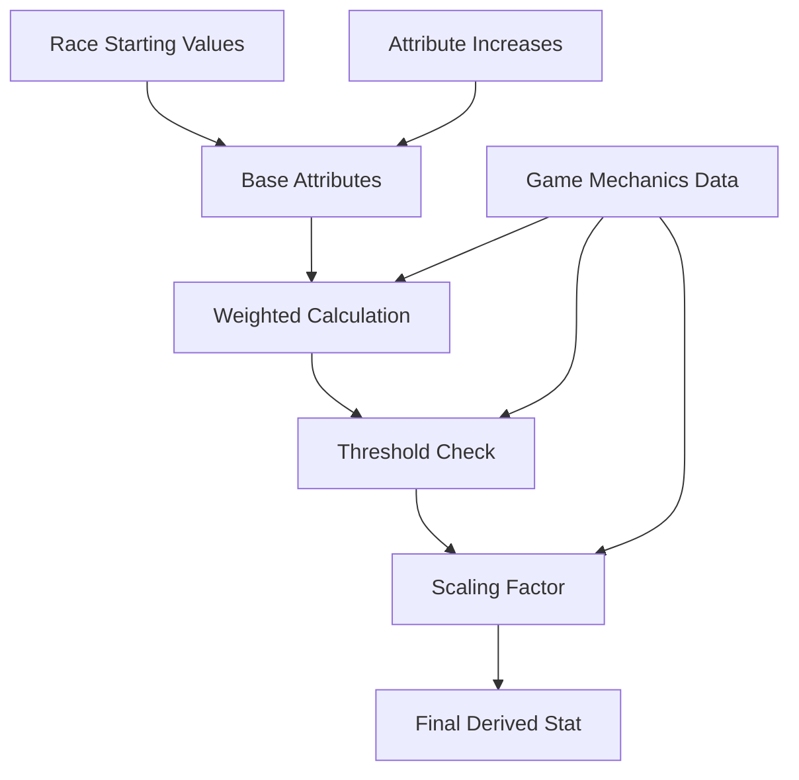
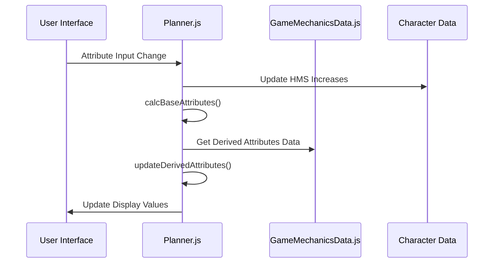
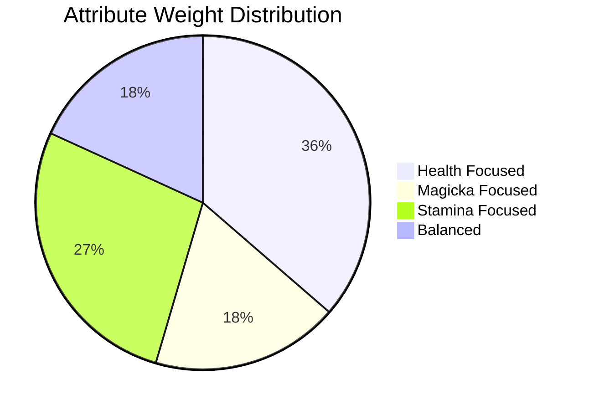

# Derived Stats System Analysis - GigaPlanner

## Executive Summary

The Derived Stats system in GigaPlanner is a sophisticated attribute calculation engine that transforms base character attributes (Health, Magicka, Stamina) into meaningful gameplay statistics. The system uses a weighted formula with thresholds and scaling factors to create 11 different derived attributes that affect combat, movement, and survival mechanics.

## System Architecture

### Core Components



### Data Flow



## Derived Attributes Breakdown

### 1. Magic Resist

- **Type**: Percentage-based
- **Formula**: `1.0 * sqrt(weightedSum - 150)`
- **Weights**: Health: 0%, Magicka: 100%, Stamina: 0%
- **Threshold**: 150
- **Purpose**: Reduces incoming magical damage

### 2. Magicka Regen

- **Type**: Percentage-based
- **Formula**: `8.0 * sqrt(weightedSum - 100)`
- **Weights**: Health: 0%, Magicka: 100%, Stamina: 0%
- **Threshold**: 100
- **Purpose**: Increases magicka regeneration rate

### 3. Disease Resist

- **Type**: Percentage-based
- **Formula**: `4.0 * sqrt(weightedSum - 100)`
- **Weights**: Health: 40%, Magicka: 0%, Stamina: 60%
- **Threshold**: 100
- **Purpose**: Reduces chance of contracting diseases

### 4. Poison Resist

- **Type**: Percentage-based
- **Formula**: `4.0 * sqrt(weightedSum - 140)`
- **Weights**: Health: 60%, Magicka: 0%, Stamina: 40%
- **Threshold**: 140
- **Purpose**: Reduces poison damage and effects

### 5. Stamina Regen

- **Type**: Percentage-based
- **Formula**: `8.0 * sqrt(weightedSum - 100)`
- **Weights**: Health: 0%, Magicka: 0%, Stamina: 100%
- **Threshold**: 100
- **Purpose**: Increases stamina regeneration rate

### 6. Move Speed

- **Type**: Percentage-based
- **Formula**: `0.75 * sqrt(weightedSum - 125)`
- **Weights**: Health: 20%, Magicka: 0%, Stamina: 80%
- **Threshold**: 125
- **Purpose**: Increases movement speed

### 7. Carry Weight

- **Type**: Flat value (not percentage)
- **Formula**: `4.0 * sqrt(weightedSum - 110)`
- **Weights**: Health: 80%, Magicka: 0%, Stamina: 20%
- **Threshold**: 110
- **Purpose**: Increases maximum carry capacity

### 8. Ranged Damage

- **Type**: Percentage-based
- **Formula**: `4.0 * sqrt(weightedSum - 150)`
- **Weights**: Health: 20%, Magicka: 0%, Stamina: 80%
- **Threshold**: 150
- **Purpose**: Increases ranged weapon damage

### 9. One-Hand Damage

- **Type**: Percentage-based
- **Formula**: `4.0 * sqrt(weightedSum - 150)`
- **Weights**: Health: 50%, Magicka: 0%, Stamina: 50%
- **Threshold**: 150
- **Purpose**: Increases one-handed weapon damage

### 10. Two-Hand Damage

- **Type**: Percentage-based
- **Formula**: `4.0 * sqrt(weightedSum - 150)`
- **Weights**: Health: 80%, Magicka: 0%, Stamina: 20%
- **Threshold**: 150
- **Purpose**: Increases two-handed weapon damage

### 11. Unarmed Damage

- **Type**: Flat value (not percentage)
- **Formula**: `4.5 * sqrt(weightedSum - 125)`
- **Weights**: Health: 50%, Magicka: 0%, Stamina: 50%
- **Threshold**: 125
- **Purpose**: Increases unarmed combat damage

## Mathematical Formula

The core calculation for each derived attribute follows this pattern:

```
weightedSum = (Health * weight_health) + (Magicka * weight_magicka) + (Stamina * weight_stamina)

if (weightedSum > threshold) {
    bonus = prefactor * sqrt(weightedSum - threshold)
    bonus = floor(bonus)
} else {
    bonus = 0
}

finalValue = "+" + bonus + (isPercent ? "%" : "")
```

## Attribute Weight Distribution



### Weight Categories:

**Health Focused (4 attributes):**

- Disease Resist (40% Health, 60% Stamina)
- Poison Resist (60% Health, 40% Stamina)
- Carry Weight (80% Health, 20% Stamina)
- Two-Hand Damage (80% Health, 20% Stamina)

**Magicka Focused (2 attributes):**

- Magic Resist (100% Magicka)
- Magicka Regen (100% Magicka)

**Stamina Focused (3 attributes):**

- Stamina Regen (100% Stamina)
- Move Speed (20% Health, 80% Stamina)
- Ranged Damage (20% Health, 80% Stamina)

**Balanced (2 attributes):**

- One-Hand Damage (50% Health, 50% Stamina)
- Unarmed Damage (50% Health, 50% Stamina)

## Implementation Details

### Data Structure

The derived attributes are defined in `gameMechanicsData.js`:

```javascript
derivedAttributes : {
    attribute : ["Magic Resist", "Magicka Regen", ...],
    isPercent : [true, true, ...],
    prefactor : [1.0, 8.0, ...],
    threshold : [150, 100, ...],
    weight_health : [0, 0, ...],
    weight_magicka : [1, 1, ...],
    weight_stamina : [0, 0, ...]
}
```

### Calculation Function

```javascript
function updateDerivedAttributes() {
  let derAttrData = curGameMechanics.derivedAttributes;
  let baseAttributes = calcBaseAttributes();

  for (let i = 0; i < derAttrData.attribute.length; i++) {
    let weightedSum = baseAttributes[0] * derAttrData.weight_health[i];
    weightedSum += baseAttributes[1] * derAttrData.weight_magicka[i];
    weightedSum += baseAttributes[2] * derAttrData.weight_stamina[i];

    let bonus = 0;
    if (weightedSum > derAttrData.threshold[i]) {
      bonus +=
        derAttrData.prefactor[i] *
        Math.sqrt(weightedSum - derAttrData.threshold[i]);
      bonus = Math.floor(bonus);
    }

    bonus = "+" + bonus;
    if (derAttrData.isPercent[i]) {
      bonus += "%";
    }

    $(`#derivedAttributeValue${i}`).html(bonus);
  }
}
```

### UI Implementation

The derived attributes are displayed in a table format:

```html
<div id="derivedAttributesDiv" class="statsSubsectionDiv">
  <div class="subsectionSubtitle">Derived Attributes</div>
  <div id="derivedAttributeTableDiv">
    <div id="derivedAttributeTable">
      <!-- Dynamically generated rows -->
    </div>
  </div>
</div>
```

## Threshold Analysis

```mermaid
bar title Threshold Values by Attribute
    Magic Resist : 150
    Magicka Regen : 100
    Disease Resist : 100
    Poison Resist : 140
    Stamina Regen : 100
    Move Speed : 125
    Carry Weight : 110
    Ranged Damage : 150
    One-Hand Damage : 150
    Two-Hand Damage : 150
    Unarmed Damage : 125
```

### Threshold Categories:

**Low Threshold (100):**

- Magicka Regen
- Disease Resist
- Stamina Regen

**Medium Threshold (110-125):**

- Carry Weight (110)
- Move Speed (125)
- Unarmed Damage (125)

**High Threshold (140-150):**

- Poison Resist (140)
- Magic Resist (150)
- Ranged Damage (150)
- One-Hand Damage (150)
- Two-Hand Damage (150)

## Scaling Factor Analysis

```mermaid
bar title Scaling Factors by Attribute
    Magic Resist : 1.0
    Magicka Regen : 8.0
    Disease Resist : 4.0
    Poison Resist : 4.0
    Stamina Regen : 8.0
    Move Speed : 0.75
    Carry Weight : 4.0
    Ranged Damage : 4.0
    One-Hand Damage : 4.0
    Two-Hand Damage : 4.0
    Unarmed Damage : 4.5
```

### Scaling Categories:

**Low Scaling (0.75-1.0):**

- Move Speed (0.75)
- Magic Resist (1.0)

**Medium Scaling (4.0-4.5):**

- Disease Resist (4.0)
- Poison Resist (4.0)
- Carry Weight (4.0)
- Ranged Damage (4.0)
- One-Hand Damage (4.0)
- Two-Hand Damage (4.0)
- Unarmed Damage (4.5)

**High Scaling (8.0):**

- Magicka Regen (8.0)
- Stamina Regen (8.0)

## Character Build Implications

### Attribute Investment Strategies

**Magicka Build:**

- Focus on Magic Resist and Magicka Regen
- High scaling factors (8.0 for regen)
- Pure magicka investment

**Stamina Build:**

- Focus on Stamina Regen, Move Speed, Ranged Damage
- High scaling for regen (8.0)
- Good for mobility and ranged combat

**Health Build:**

- Focus on Carry Weight, Two-Hand Damage, Poison Resist
- Balanced scaling factors
- Good for heavy weapons and survival

**Balanced Build:**

- Invest in all three attributes
- Access to One-Hand and Unarmed damage bonuses
- Versatile gameplay options

## System Strengths

1. **Scalable Design**: The sqrt-based formula prevents exponential growth
2. **Threshold System**: Encourages strategic attribute investment
3. **Weighted Calculations**: Allows for diverse build strategies
4. **Modular Data**: Easy to modify values without code changes
5. **Clear UI**: Simple table display with percentage/flat value distinction

## Potential Improvements

1. **Data Validation**: Add bounds checking for attribute values
2. **Performance**: Cache calculations for unchanged attributes
3. **Visualization**: Add graphs showing attribute relationships
4. **Tooltips**: Explain calculation formulas to users
5. **Build Templates**: Preset attribute distributions for common builds

## Technical Debt

1. **Hardcoded Values**: Some arrays have mismatched lengths
2. **Magic Numbers**: Threshold and scaling values could be constants
3. **Error Handling**: No validation for invalid attribute combinations
4. **Documentation**: Limited inline comments explaining the math

## Conclusion

The Derived Stats system provides a sophisticated foundation for character progression that rewards strategic attribute investment while maintaining game balance through carefully tuned thresholds and scaling factors. The system successfully translates base attributes into meaningful gameplay mechanics that support diverse character builds and playstyles.
