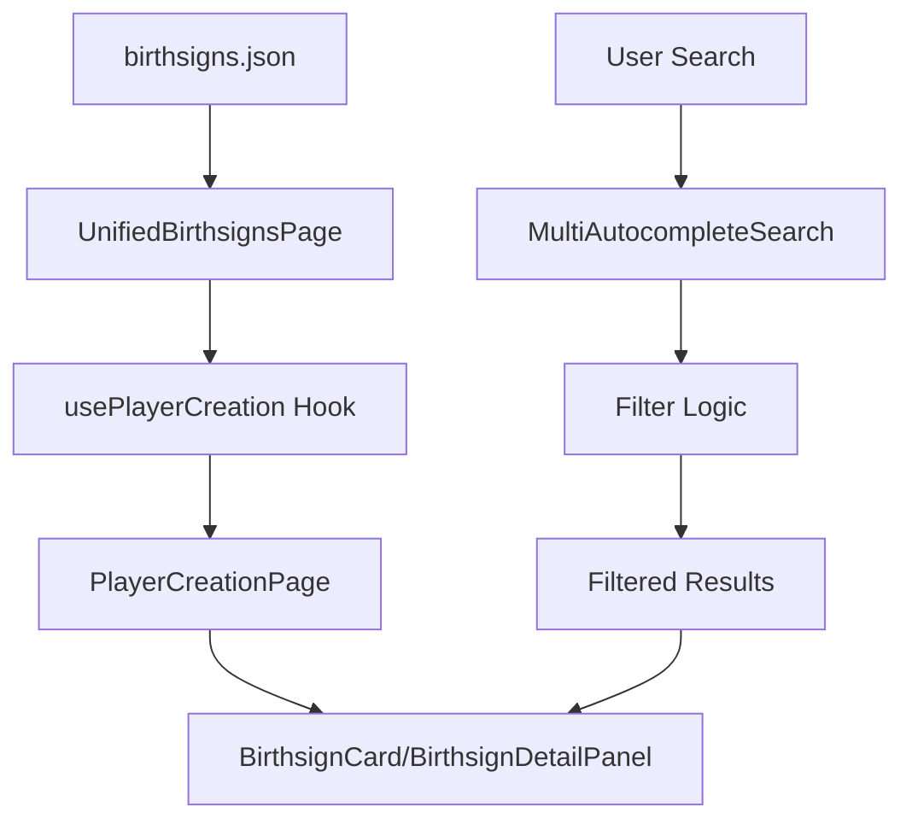

# Birthsigns Feature Documentation

## 📋 General Rule for Feature Documentation

All features in the Lorerim Arcaneum project must follow this standardized documentation structure. This ensures consistency, maintainability, and comprehensive coverage of feature functionality, architecture, and implementation details.

---

## 🎯 Feature Overview

### Purpose
The Birthsigns feature provides a comprehensive interface for browsing and selecting character birthsigns in the Lorerim Arcaneum application. It leverages a shared player creation framework to deliver a consistent, searchable, and filterable experience for birthsign selection, enabling players to explore celestial constellations and their associated magical effects, abilities, and character bonuses.

### Core Functionality
- **Birthsign Browsing**: Display all available birthsigns in grid/list view modes with visual constellation indicators
- **Advanced Search**: Multi-category autocomplete search by constellation types, effect categories, and tags
- **Detailed Information**: Comprehensive birthsign details including abilities, effects, requirements, and lore
- **Filtering**: Tag-based filtering system for constellation types, effect categories, and tags
- **Responsive Design**: Mobile-friendly interface with adaptive layouts
- **Markdown Support**: Rich text rendering with support for bold formatting, lists, and emphasis

### Data Structure
Birthsigns are defined with the following structure:

```typescript
interface Birthsign {
  id: string
  name: string
  constellation: string
  description: string
  lore: string
  abilities: BirthsignAbility[]
  requirements: string[]
  tags: string[]
  levelRequirement?: number
  globalFormId?: string
}

interface BirthsignAbility {
  name: string
  description: string
  effectType: 'passive' | 'active' | 'conditional'
  magnitude: number
  duration?: number
  cooldown?: number
  requirements?: string[]
  effects: string[]
}

interface BirthsignEffect {
  name: string
  description: string
  magnitude: number
  duration: number
  targetAttribute: string
  keywords: string[]
}
```

---

## 🏗️ Component Architecture

### Component Tree
```
UnifiedBirthsignsPage
├── PlayerCreationPage (shared)
│   ├── Header (title + description)
│   ├── Search & Filters
│   │   ├── MultiAutocompleteSearch
│   │   │   └── AutocompleteSearch (multiple instances)
│   │   ├── SelectedTags
│   │   └── ViewModeToggle (grid/list)
│   ├── ItemGrid
│   │   └── BirthsignCard (custom render)
│   └── DetailPanel
│       └── BirthsignDetailPanel (custom render)
└── Loading/Error States
```

### Component Responsibilities

#### **UnifiedBirthsignsPage** (`pages/UnifiedBirthsignsPage.tsx`)
- **Purpose**: Primary orchestrator and data manager for birthsign selection
- **Key Functions**:
  - Data fetching from `public/data/birthsigns.json`
  - Data transformation from `Birthsign` to `PlayerCreationItem` format
  - Search category generation for autocomplete (Constellations, Effect Types, Tags)
  - Custom render function provision for birthsign-specific components
  - Error handling and loading states

#### **BirthsignCard** (`components/BirthsignCard.tsx`)
- **Purpose**: Compact birthsign representation in grid/list views
- **Features**:
  - Visual constellation indicators with icons and color coding
  - Tag display with overflow handling
  - Selection state management
  - Responsive design with hover effects
  - Accessibility considerations with ARIA labels

#### **BirthsignDetailPanel** (`components/BirthsignDetailPanel.tsx`)
- **Purpose**: Comprehensive birthsign information display with tabbed interface
- **Features**:
  - **Abilities Tab**: Active and passive abilities with effect details
  - **Lore Tab**: Constellation lore and background information
  - **Requirements Tab**: Level requirements and prerequisites
  - Effect details with magnitude and duration visualization
  - Markdown rendering for descriptions
  - Tag categorization and display

---

## 🔧 Technical Design

### Data Flow Architecture



### State Management

The feature uses a combination of local state and shared hooks:

1. **Local State** (`UnifiedBirthsignsPage`):
   - `birthsigns`: Raw birthsign data from JSON
   - `loading`: Data fetching state
   - `error`: Error handling state

2. **Shared State** (`usePlayerCreation`):
   - `selectedItem`: Currently selected birthsign
   - `viewMode`: Grid or list view preference
   - `currentFilters`: Active search and filter state
   - `filteredItems`: Computed filtered results

### Data Transformation

The feature transforms birthsign data between two formats:

**Source Format** (`Birthsign`):
```typescript
{
  id: "warrior",
  name: "The Warrior",
  constellation: "Warrior",
  description: "The Warrior grants increased combat abilities...",
  abilities: [...],
  requirements: [...],
  tags: ["Combat", "Strength"]
}
```

**Target Format** (`PlayerCreationItem`):
```typescript
{
  id: "warrior",
  name: "The Warrior",
  description: "The Warrior grants increased combat abilities...",
  tags: ["Combat", "Strength"],
  effects: [...],
  category: "Warrior"
}
```

### Search & Filtering System

#### Search Categories
- **Constellations**: Search by constellation types (Warrior, Mage, Thief, Serpent, etc.)
- **Effect Types**: Filter by effect categories (Combat, Magic, Stealth, Utility)
- **Tags**: Filter by birthsign tags (Combat, Strength, Intelligence, etc.)

#### Filter Logic
```typescript
// Multi-layered filtering
1. Text Search: name, description, ability names
2. Constellation Filter: Warrior/Mage/Thief/Serpent categorization
3. Tag Filter: Tag-based filtering with effect types and requirements
```

---

## 🎨 UI/UX Design Patterns

### Visual Hierarchy
1. **Primary**: Birthsign name and constellation
2. **Secondary**: Tabbed interface (Abilities vs Lore vs Requirements)
3. **Tertiary**: Detailed content within each tab

### Icon System
- **Constellation Icons**: Color-coded by constellation type
  - ⚔️ Warrior (red)
  - 🔮 Mage (blue)
  - 🗡️ Thief (green)
  - 🐍 Serpent (purple)
  - ⭐ Other constellations (gold)

- **Tab Icons**: Visual indicators for content types
  - ⚡ Abilities tab (blue dot) - Active and passive abilities
  - 📖 Lore tab (yellow dot) - Constellation lore
  - 🔒 Requirements tab (gray dot) - Prerequisites and requirements
- **Effect Icons**: Color-coded by effect type
  - ⚔️ Combat abilities (red)
  - 🔮 Magic abilities (blue)
  - 🗡️ Stealth abilities (green)
  - ⚡ Utility abilities (purple)

### Responsive Design
- **Desktop**: 3-column grid with sidebar detail panel
- **Tablet**: 2-column grid with bottom detail panel
- **Mobile**: Single column with modal detail panel

### Interaction Patterns
- **Hover Effects**: Subtle scaling and shadow changes
- **Selection States**: Ring borders and visual indicators
- **Loading States**: Skeleton screens and spinners
- **Error States**: Clear messaging with retry options

---

## 🔄 Reusable Components

### Shared Framework Components

The birthsigns feature leverages the same comprehensive shared framework as races and religions:

#### **PlayerCreationPage**
- Generic layout for categorized item selection
- Built-in search, filtering, and view mode management
- Customizable render functions for item cards and detail panels

#### **MultiAutocompleteSearch**
- Multi-category search interface
- Tag-based filtering system
- Keyboard navigation support

#### **ItemGrid**
- Responsive grid/list view switching
- Selection state management
- Empty state handling

### Birthsign-Specific Components

#### **BirthsignCard**
- **Reusability**: Can be adapted for other entity types
- **Customization**: Icon mapping and color schemes
- **Accessibility**: ARIA labels and keyboard navigation

#### **BirthsignDetailPanel**
- **Extensibility**: Modular ability, lore, and requirement sections
- **Data Visualization**: Effect icons and color coding
- **Information Architecture**: Hierarchical content organization

---

## 📊 Performance Considerations

### Data Loading
- **Runtime Fetching**: Birthsigns loaded from JSON at component mount
- **Error Boundaries**: Graceful fallbacks for network issues
- **Loading States**: User feedback during data fetching

### Rendering Optimization
- **Memoization**: Filtered results cached with `useMemo`
- **Virtual Scrolling**: Large lists handled efficiently
- **Lazy Loading**: Images and heavy content loaded on demand

### Search Performance
- **Debounced Input**: Search queries optimized for performance
- **Indexed Filtering**: Pre-computed search indices
- **Cached Results**: Filtered results memoized

---

## 🧪 Testing Strategy

### Unit Tests
- Component rendering and props validation
- Data transformation logic
- Filter and search functionality

### Integration Tests
- End-to-end birthsign selection flow
- Search and filter interactions
- Responsive design breakpoints

### Accessibility Tests
- Screen reader compatibility
- Keyboard navigation
- Color contrast compliance

---

## 🔮 Future Enhancements

### Planned Features
1. **Birthsign Comparison**: Side-by-side birthsign comparison tool
2. **Favorites System**: Save preferred birthsigns for quick access
3. **Advanced Filtering**: Multi-select filters and saved searches
4. **Birthsign Recommendations**: AI-powered birthsign suggestions based on playstyle
5. **Constellation Visualization**: Interactive star map showing birthsign positions
6. **Seasonal Effects**: Dynamic effects based on in-game seasons or time

### Technical Improvements
1. **Data Caching**: Implement service worker for offline access
2. **Real-time Updates**: WebSocket integration for live data
3. **Analytics**: User behavior tracking for optimization
4. **Internationalization**: Multi-language support

---

## 📚 Related Documentation

- [Shared Framework Documentation](../shared/components/playerCreation/README.md)
- [UI Component Library](../shared/ui/README.md)
- [Technical Specifications](../../../docs/technical-spec.md)
- [Design System](../../../docs/ui-styling.md)

---

## ✅ Documentation Checklist

### Required Sections
- [x] Feature Overview with clear purpose statement
- [x] Component Architecture with visual hierarchy
- [x] Technical Design with data flow diagrams
- [x] UI/UX Design Patterns with responsive considerations
- [x] Reusable Components documentation
- [x] Performance Considerations
- [x] Testing Strategy
- [x] Future Enhancements roadmap
- [x] Related Documentation links

### Quality Standards
- [x] Clear, concise language throughout
- [x] Code examples for all interfaces and transformations
- [x] Visual diagrams for complex flows
- [x] Consistent emoji usage for section headers
- [x] Proper TypeScript interface definitions
- [x] Mermaid diagrams for data flow
- [x] Comprehensive component responsibility descriptions
- [x] Accessibility considerations documented
- [x] Performance optimization strategies outlined

---

*This documentation ensures the Birthsigns feature in the Lorerim Arcaneum project maintains consistent, comprehensive documentation that supports development, maintenance, and future enhancements.* 