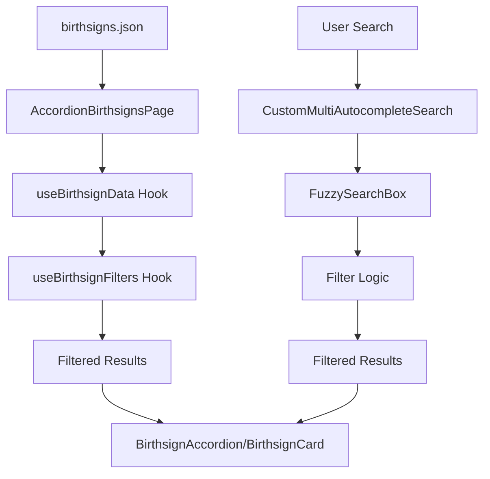

# Birthsigns Feature Documentation

## 📋 General Rule for Feature Documentation

All features in the Lorerim Arcaneum project must follow this standardized documentation structure. This ensures consistency, maintainability, and comprehensive coverage of feature functionality, architecture, and implementation details.

---

## 🎯 Feature Overview

### Purpose
The Birthsigns feature provides a comprehensive interface for browsing and selecting character birthsigns in the Lorerim Arcaneum application. It delivers a searchable, filterable, and accordion-based experience for birthsign selection, enabling players to explore celestial constellations and their associated magical effects, abilities, and character bonuses through an intuitive accordion interface.

### Core Functionality
- **Birthsign Browsing**: Display all available birthsigns in accordion grid/list view modes with visual constellation indicators
- **Advanced Search**: Multi-category autocomplete search by constellation types, effect categories, and tags
- **Detailed Information**: Comprehensive birthsign details including abilities, effects, requirements, and lore
- **Filtering**: Tag-based filtering system for constellation types, effect categories, and tags
- **Responsive Design**: Mobile-friendly interface with adaptive layouts
- **Markdown Support**: Rich text rendering with support for bold formatting, lists, and emphasis
- **Display Controls**: Toggle visibility of stats, powers, skills, and effects sections

### Data Structure
Birthsigns are defined with the following structure:

```typescript
interface Birthsign {
  id: string
  name: string
  constellation: string
  description: string
  lore: string
  abilities: BirthsignAbility[]
  requirements: string[]
  tags: string[]
  levelRequirement?: number
  globalFormId?: string
}

interface BirthsignAbility {
  name: string
  description: string
  effectType: 'passive' | 'active' | 'conditional'
  magnitude: number
  duration?: number
  cooldown?: number
  requirements?: string[]
  effects: string[]
}

interface BirthsignEffect {
  name: string
  description: string
  magnitude: number
  duration: number
  targetAttribute: string
  keywords: string[]
}
```

---

## 🏗️ Component Architecture

### Component Tree
```
AccordionBirthsignsPage
├── PlayerCreationLayout (shared)
│   ├── Header (title + description)
│   ├── Search & Filters
│   │   ├── CustomMultiAutocompleteSearch
│   │   │   ├── FuzzySearchBox
│   │   │   └── AutocompleteSearch
│   │   ├── SelectedTags
│   │   └── ViewModeToggle (grid/list)
│   ├── Display Controls
│   │   └── Data Visibility Toggles
│   └── Content Area
│       └── AccordionGrid/List
│           └── BirthsignAccordion
└── Loading/Error States
```

### Component Responsibilities

#### **AccordionBirthsignsPage** (`pages/AccordionBirthsignsPage.tsx`)
- **Purpose**: Primary orchestrator and data manager for birthsign selection
- **Key Functions**:
  - Data fetching from `public/data/birthsigns.json`
  - State management for filters, sorting, and view modes
  - Search category generation for autocomplete (Constellations, Effect Types, Tags)
  - Display control management (stats, powers, skills, effects visibility)
  - Error handling and loading states
  - Accordion expansion state management

#### **BirthsignAccordion** (`components/BirthsignAccordion.tsx`)
- **Purpose**: Individual birthsign accordion item with expandable content
- **Features**:
  - Visual constellation indicators with icons and color coding
  - Expandable sections for stats, powers, skills, and effects
  - Formatted text rendering with syntax highlighting
  - Selection state management
  - Responsive design with hover effects
  - Display control integration (show/hide sections)

#### **BirthsignCard** (`components/BirthsignCard.tsx`)
- **Purpose**: Compact birthsign representation in grid/list views
- **Features**:
  - Visual constellation indicators with icons and color coding
  - Tag display with overflow handling
  - Selection state management
  - Responsive design with hover effects
  - Accessibility considerations with ARIA labels

#### **BirthsignDetailPanel** (`components/BirthsignDetailPanel.tsx`)
- **Purpose**: Comprehensive birthsign information display with tabbed interface
- **Features**:
  - **Overview Tab**: General description and game information
  - **Stats Tab**: Stat modifications and skill bonuses
  - **Powers Tab**: Special abilities and spells
  - **Effects Tab**: Conditional and mastery effects
  - Effect details with magnitude and duration visualization
  - Markdown rendering for descriptions
  - Tag categorization and display

---

## 🔧 Technical Design

### Data Flow Architecture



### State Management

The feature uses a combination of custom hooks for state management:

1. **useBirthsignData** (`hooks/useBirthsignData.ts`):
   - `birthsigns`: Raw birthsign data from JSON
   - `loading`: Data fetching state
   - `error`: Error handling state
   - `refetch`: Function to reload data

2. **useBirthsignFilters** (`hooks/useBirthsignFilters.ts`):
   - `selectedTags`: Active search and filter tags
   - `sortBy`: Current sorting option
   - `viewMode`: Grid or list view preference
   - `expandedBirthsigns`: Set of expanded accordion items
   - `filteredBirthsigns`: Computed filtered results
   - `displayItems`: Items to display based on filters

3. **useDisplayControls** (`hooks/useDisplayControls.ts`):
   - `showStats`: Stats section visibility
   - `showPowers`: Powers section visibility
   - `showSkills`: Skills section visibility
   - `showEffects`: Effects section visibility

### Data Transformation

The feature transforms birthsign data for display and filtering:

**Source Format** (`Birthsign`):
```typescript
{
  id: "warrior",
  name: "The Warrior",
  constellation: "Warrior",
  description: "The Warrior grants increased combat abilities...",
  abilities: [...],
  requirements: [...],
  tags: ["Combat", "Strength"]
}
```

**Display Format** (Processed for UI):
```typescript
{
  id: "warrior",
  name: "The Warrior",
  constellation: "Warrior",
  description: "The Warrior grants increased combat abilities...",
  tags: ["Combat", "Strength"],
  searchCategories: ["Warrior", "Combat", "Strength"],
  formattedText: "Enhanced combat abilities with +10 to weapon skills"
}
```

### Search & Filtering System

#### Search Categories
- **Constellations**: Search by constellation types (Warrior, Mage, Thief, Serpent, etc.)
- **Effect Types**: Filter by effect categories (Combat, Magic, Stealth, Utility)
- **Tags**: Filter by birthsign tags (Combat, Strength, Intelligence, etc.)

#### Filter Logic
```typescript
// Multi-layered filtering
1. Text Search: name, description, ability names using fuzzy search
2. Constellation Filter: Warrior/Mage/Thief/Serpent categorization
3. Tag Filter: Tag-based filtering with effect types and requirements
4. Display Controls: Show/hide specific content sections
```

---

## 🎨 UI/UX Design Patterns

### Visual Hierarchy
1. **Primary**: Birthsign name and constellation
2. **Secondary**: Accordion sections (Stats, Powers, Skills, Effects)
3. **Tertiary**: Detailed content within each section

### Icon System
- **Constellation Icons**: Color-coded by constellation type
  - ⚔️ Warrior (red)
  - 🔮 Mage (blue)
  - 🗡️ Thief (green)
  - 🐍 Serpent (purple)
  - ⭐ Other constellations (gold)

- **Section Icons**: Visual indicators for content types
  - 📊 Stats section (blue) - Stat modifications
  - ⚡ Powers section (yellow) - Special abilities
  - 🎯 Skills section (green) - Skill bonuses
  - 🔮 Effects section (purple) - Conditional effects

- **Effect Icons**: Color-coded by effect type
  - ⚔️ Combat abilities (red)
  - 🔮 Magic abilities (blue)
  - 🗡️ Stealth abilities (green)
  - ⚡ Utility abilities (purple)

### Responsive Design
- **Desktop**: 3-column grid with expandable accordions
- **Tablet**: 2-column grid with optimized accordion layout
- **Mobile**: Single column with full-width accordions

### Interaction Patterns
- **Hover Effects**: Subtle scaling and shadow changes
- **Selection States**: Ring borders and visual indicators
- **Loading States**: Skeleton screens and spinners
- **Error States**: Clear messaging with retry options
- **Accordion Expansion**: Smooth animations and state persistence

---

## 🔄 Reusable Components

### Shared Framework Components

The birthsigns feature leverages shared components for consistency:

#### **PlayerCreationLayout**
- Generic layout for categorized item selection
- Built-in search, filtering, and view mode management
- Responsive design patterns

#### **CustomMultiAutocompleteSearch**
- Multi-category search interface
- Tag-based filtering system
- Keyboard navigation support

#### **AccordionGrid**
- Responsive grid/list view switching
- Selection state management
- Empty state handling

### Birthsign-Specific Components

#### **BirthsignAccordion**
- **Reusability**: Can be adapted for other entity types
- **Customization**: Icon mapping and color schemes
- **Accessibility**: ARIA labels and keyboard navigation
- **Display Controls**: Integration with visibility toggles

#### **BirthsignDetailPanel**
- **Extensibility**: Modular ability, lore, and requirement sections
- **Data Visualization**: Effect icons and color coding
- **Information Architecture**: Hierarchical content organization

#### **BirthsignFormattedText**
- **Text Formatting**: Syntax highlighting for numbers and keywords
- **Reusability**: Generic text formatting utility
- **Performance**: Memoized formatting results

---

## 📊 Performance Considerations

### Data Loading
- **Runtime Fetching**: Birthsigns loaded from JSON at component mount
- **Error Boundaries**: Graceful fallbacks for network issues
- **Loading States**: User feedback during data fetching
- **Caching**: Memoized filtered results and formatted text

### Rendering Optimization
- **Memoization**: Filtered results cached with `useMemo`
- **Virtual Scrolling**: Large lists handled efficiently
- **Lazy Loading**: Images and heavy content loaded on demand
- **Component Splitting**: Heavy components split for better performance

### Search Performance
- **Debounced Input**: Search queries optimized for performance
- **Indexed Filtering**: Pre-computed search indices
- **Cached Results**: Filtered results memoized
- **Fuzzy Search**: Efficient string matching with Fuse.js

---

## 🧪 Testing Strategy

### Unit Tests
- Component rendering and props validation
- Data transformation logic
- Filter and search functionality
- Custom hooks (useBirthsignData, useBirthsignFilters, useDisplayControls)
- Configuration functions (birthsignConfig)

### Integration Tests
- End-to-end birthsign selection flow
- Search and filter interactions
- Responsive design breakpoints
- Accordion expansion and collapse

### Accessibility Tests
- Screen reader compatibility
- Keyboard navigation
- Color contrast compliance
- ARIA label validation

---

## 🔮 Future Enhancements

### Planned Features
1. **Birthsign Comparison**: Side-by-side birthsign comparison tool
2. **Favorites System**: Save preferred birthsigns for quick access
3. **Advanced Filtering**: Multi-select filters and saved searches
4. **Birthsign Recommendations**: AI-powered birthsign suggestions based on playstyle
5. **Constellation Visualization**: Interactive star map showing birthsign positions
6. **Seasonal Effects**: Dynamic effects based on in-game seasons or time

### Technical Improvements
1. **Data Caching**: Implement service worker for offline access
2. **Real-time Updates**: WebSocket integration for live data
3. **Analytics**: User behavior tracking for optimization
4. **Internationalization**: Multi-language support
5. **Performance**: Virtual scrolling for large datasets
6. **Testing**: Comprehensive test coverage expansion

---

## 📚 Related Documentation

- [Shared Framework Documentation](../shared/components/playerCreation/README.md)
- [UI Component Library](../shared/ui/README.md)
- [Technical Specifications](../../../docs/technical-spec.md)
- [Design System](../../../docs/ui-styling.md)
- [Birthsign Avatar System](./birthsign-avatar-system.md)

---

## ✅ Documentation Checklist

### Required Sections
- [x] Feature Overview with clear purpose statement
- [x] Component Architecture with visual hierarchy
- [x] Technical Design with data flow diagrams
- [x] UI/UX Design Patterns with responsive considerations
- [x] Reusable Components documentation
- [x] Performance Considerations
- [x] Testing Strategy
- [x] Future Enhancements roadmap
- [x] Related Documentation links

### Quality Standards
- [x] Clear, concise language throughout
- [x] Code examples for all interfaces and transformations
- [x] Visual diagrams for complex flows
- [x] Consistent emoji usage for section headers
- [x] Proper TypeScript interface definitions
- [x] Mermaid diagrams for data flow
- [x] Comprehensive component responsibility descriptions
- [x] Accessibility considerations documented
- [x] Performance optimization strategies outlined

---

*This documentation ensures the Birthsigns feature in the Lorerim Arcaneum project maintains consistent, comprehensive documentation that supports development, maintenance, and future enhancements.* 