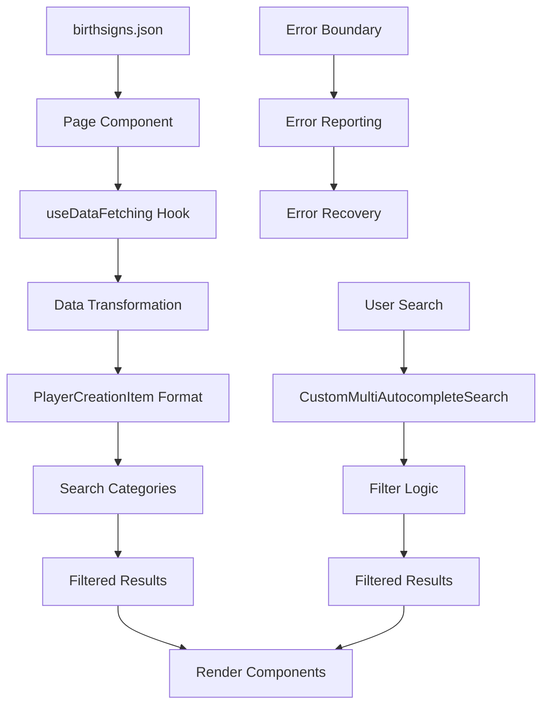

# Birthsigns Feature Documentation

## 📋 Overview

The Birthsigns feature provides comprehensive interfaces for browsing and selecting character birthsigns in the Lorerim Arcaneum application. It offers two distinct implementations: a unified player creation interface and an accordion-based browsing experience, both leveraging shared frameworks for consistency and maintainability.

## 🎯 Feature Overview

### Purpose

The Birthsigns feature enables players to explore celestial constellations and their associated magical effects, abilities, and character bonuses. It provides both streamlined selection (UnifiedBirthsignsPage) and detailed exploration (AccordionBirthsignsPage) interfaces to accommodate different user preferences and use cases.

### Core Functionality

- **Birthsign Browsing**: Display all available birthsigns in multiple view modes
- **Advanced Search**: Multi-category autocomplete search by constellation types, effect categories, and tags
- **Detailed Information**: Comprehensive birthsign details including abilities, effects, requirements, and lore
- **Filtering**: Tag-based filtering system for constellation types, effect categories, and tags
- **Responsive Design**: Mobile-friendly interface with adaptive layouts
- **Markdown Support**: Rich text rendering with support for bold formatting, lists, and emphasis
- **Error Handling**: Comprehensive error boundaries and recovery mechanisms

### Data Structure

```typescript
interface Birthsign {
  id: string
  name: string
  description: string
  group: string
  powers: BirthsignPower[]
  statModifications: StatModification[]
  skillBonuses: SkillBonus[]
  conditionalEffects: ConditionalEffect[]
  masteryEffects: MasteryEffect[]
  tags: string[]
}

interface BirthsignPower {
  name: string
  description: string
  magnitude: number
  duration: number
  requirements?: string[]
}

interface StatModification {
  stat: string
  value: number
  description: string
}

interface SkillBonus {
  skill: string
  value: number
  description: string
}
```

---

## 🏗️ Component Architecture

### Implementation Options

The feature provides two distinct page implementations:

#### **UnifiedBirthsignsPage** (`pages/UnifiedBirthsignsPage.tsx`)

- **Purpose**: Streamlined player creation interface using shared PlayerCreationPage framework
- **Use Case**: Quick birthsign selection during character creation
- **Layout**: Sidebar selection with detail panel

#### **AccordionBirthsignsPage** (`pages/AccordionBirthsignsPage.tsx`)

- **Purpose**: Detailed exploration interface with expandable accordion items
- **Use Case**: Comprehensive birthsign research and comparison
- **Layout**: Grid/list view with expandable content sections

### Component Tree

#### UnifiedBirthsignsPage Architecture

```
UnifiedBirthsignsPage
├── ErrorBoundary
├── PlayerCreationPage (shared)
│   ├── Header (title + description)
│   ├── Search & Filters
│   │   ├── CustomMultiAutocompleteSearch
│   │   ├── FuzzySearchBox
│   │   └── SelectedTags
│   ├── ItemGrid
│   │   └── BirthsignCard (renderItemCard)
│   └── DetailPanel
│       └── BirthsignDetailPanel (renderDetailPanel)
└── Loading/Error States
```

#### AccordionBirthsignsPage Architecture

```
AccordionBirthsignsPage
├── ErrorBoundary
├── PlayerCreationLayout (shared)
│   ├── Header (title + description)
│   ├── Search & Filters
│   │   ├── CustomMultiAutocompleteSearch
│   │   ├── FuzzySearchBox
│   │   └── SelectedTags
│   ├── View Controls
│   │   ├── Sort Options
│   │   ├── View Mode Toggle
│   │   └── Expand/Collapse All
│   ├── Display Controls
│   │   └── Data Visibility Toggles
│   └── Content Area
│       └── AccordionGrid/List
│           └── BirthsignAccordion
└── Loading/Error States
```

### Component Responsibilities

#### **UnifiedBirthsignsPage** (`pages/UnifiedBirthsignsPage.tsx`)

- **Purpose**: Streamlined birthsign selection interface
- **Key Functions**:
  - Data fetching with error handling using `useDataFetching`
  - Data transformation from `Birthsign` to `PlayerCreationItem` format
  - Search category generation for autocomplete
  - Custom render functions for cards and detail panels
  - Error boundary integration with reporting

#### **AccordionBirthsignsPage** (`pages/AccordionBirthsignsPage.tsx`)

- **Purpose**: Comprehensive birthsign exploration interface
- **Key Functions**:
  - Data fetching and state management via custom hooks
  - Advanced filtering and sorting capabilities
  - View mode management (grid/list)
  - Expand/collapse state management
  - Display control toggles for content sections

#### **BirthsignAccordion** (`components/BirthsignAccordion.tsx`)

- **Purpose**: Individual birthsign accordion item with expandable content
- **Features**:
  - Visual constellation indicators with icons and color coding
  - Expandable sections for stats, powers, skills, and effects
  - Formatted text rendering with syntax highlighting
  - Selection state management
  - Responsive design with hover effects

#### **BirthsignCard** (`components/BirthsignCard.tsx`)

- **Purpose**: Compact birthsign representation in grid/list views
- **Features**:
  - Visual constellation indicators with icons and color coding
  - Tag display with overflow handling
  - Selection state management
  - Responsive design with hover effects
  - Accessibility considerations with ARIA labels

#### **BirthsignDetailPanel** (`components/BirthsignDetailPanel.tsx`)

- **Purpose**: Comprehensive birthsign information display with tabbed interface
- **Features**:
  - **Overview Tab**: General description and game information
  - **Stats Tab**: Stat modifications and skill bonuses
  - **Powers Tab**: Special abilities and spells
  - **Effects Tab**: Conditional and mastery effects
  - Effect details with magnitude and duration visualization
  - Markdown rendering for descriptions
  - Tag categorization and display

---

## 🔧 Technical Design

### Data Flow Architecture



### State Management

The feature uses a combination of local state and custom hooks:

#### **UnifiedBirthsignsPage State**:

- `selectedItem`: Currently selected birthsign for detail panel
- `birthsigns`: Raw birthsign data from JSON
- `loading/error`: Data fetching state via `useDataFetching`

#### **AccordionBirthsignsPage State**:

- `birthsigns`: Raw birthsign data from JSON
- `loading/error`: Data fetching state
- `expandedBirthsigns`: Set of expanded accordion items
- `sortBy`: Current sorting option
- `viewMode`: Grid or list view preference
- `selectedTags`: Active search and filter tags
- `showStats/showPowers/showSkills/showEffects`: Display controls

#### **Custom Hooks**:

- `useBirthsignData`: Data fetching and management
- `useBirthsignFilters`: Filter and sort state management
- `useDisplayControls`: Display toggle state management
- `useFuzzySearch`: Fuzzy search functionality using Fuse.js

### Data Transformation

#### **Source Format** (Birthsign):

```typescript
{
  id: string
  name: string
  description: string
  group: string
  powers: BirthsignPower[]
  statModifications: StatModification[]
  skillBonuses: SkillBonus[]
  conditionalEffects: ConditionalEffect[]
  masteryEffects: MasteryEffect[]
  tags: string[]
}
```

#### **Target Format** (PlayerCreationItem):

```typescript
{
  id: string
  name: string
  description: string
  category: string
  tags: string[]
  metadata: {
    group: string
    powerCount: number
    effectCount: number
  }
}
```

### Search & Filtering System

#### Search Categories

- **Fuzzy Search**: Full-text search across names, descriptions, and abilities
- **Birthsign Groups**: Filter by constellation types (Warrior, Mage, Thief, etc.)
- **Stats & Skills**: Filter by affected attributes and skills

#### Filter Logic

```typescript
// Multi-category filtering approach
1. Text Search: Fuse.js fuzzy matching on name, description, abilities
2. Category Filter: Exact match on birthsign groups
3. Tag Filter: Tag-based filtering for stats, skills, and effects
4. Combined Logic: Intersection of all active filters
```

---

## 🎨 UI/UX Design Patterns

### Visual Hierarchy

1. **Primary**: Birthsign name and group identification
2. **Secondary**: Key abilities and stat modifications
3. **Tertiary**: Detailed effects and requirements

### Icon System

- **Group Icons**: Color-coded by birthsign group
  - ⚔️ Warrior (red) - Combat-focused birthsigns
  - 🧙‍♂️ Mage (blue) - Magic-focused birthsigns
  - 🥷 Thief (green) - Stealth-focused birthsigns
  - ⚖️ Atronach (purple) - Specialized birthsigns

- **Effect Icons**: Visual indicators for different effect types
  - ⚡ Positive Effects (green) - Beneficial modifications
  - ⚠️ Negative Effects (red) - Detrimental modifications
  - 🔄 Conditional Effects (blue) - Situational bonuses

### Responsive Design

- **Desktop**: Multi-column layout with sidebar detail panel
- **Tablet**: Reduced columns with bottom detail panel
- **Mobile**: Single column with modal detail overlay

### Interaction Patterns

- **Hover Effects**: Visual feedback for interactive elements
- **Selection States**: Clear indication of selected birthsigns
- **Loading States**: Skeleton loaders and progress indicators
- **Error States**: Graceful error handling with retry options

---

## 🔄 Reusable Components

### Shared Framework Components

#### **PlayerCreationPage** (UnifiedBirthsignsPage)

- Generic player creation interface
- Customizable render functions for cards and detail panels
- Built-in search and filtering capabilities
- Responsive layout management

#### **PlayerCreationLayout** (AccordionBirthsignsPage)

- Flexible layout framework for content organization
- Header, search, and content area management
- Responsive design patterns

#### **ErrorBoundary**

- Comprehensive error catching and recovery
- Custom fallback UI components
- Error reporting integration

### Feature-Specific Components

#### **BirthsignCard**

- **Reusability**: Adaptable for other entity types
- **Customization**: Configurable visual indicators and content
- **Accessibility**: ARIA labels and keyboard navigation

#### **BirthsignAccordion**

- **Extensibility**: Modular content sections
- **Data Visualization**: Effect magnitude and duration display
- **Information Architecture**: Organized content hierarchy

#### **BirthsignDetailPanel**

- **Modularity**: Tabbed content organization
- **Rich Content**: Markdown rendering and data visualization
- **Interactive Elements**: Expandable sections and tooltips

---

## 📊 Performance Considerations

### Data Loading

- **Loading Strategy**: Efficient data fetching with retry mechanisms
- **Error Boundaries**: Comprehensive fallback mechanisms
- **Loading States**: User feedback during data loading

### Rendering Optimization

- **Memoization**: React.memo and useMemo for expensive computations
- **Virtual Scrolling**: Efficient rendering for large datasets
- **Lazy Loading**: On-demand content loading for detail panels

### Search Performance

- **Debouncing**: Input optimization for search queries
- **Indexing**: Fuse.js fuzzy search indexing
- **Caching**: Result caching for repeated searches

---

## 🧪 Testing Strategy

### Unit Tests

- Component rendering and props validation
- Data transformation logic
- Filter and search functionality
- Error boundary behavior

### Integration Tests

- End-to-end feature workflows
- Component interaction testing
- Responsive design validation
- Error recovery scenarios

### Accessibility Tests

- Screen reader compatibility
- Keyboard navigation
- Color contrast compliance
- ARIA label validation

---

## 🔮 Future Enhancements

### Planned Features

1. **Birthsign Comparison**: Side-by-side comparison interface
2. **Build Integration**: Direct integration with character builds
3. **Advanced Filtering**: Multi-dimensional filter combinations
4. **Visual Effects**: Animated constellation displays

### Technical Improvements

1. **Performance Optimization**: Virtual scrolling for large datasets
2. **Caching Strategy**: Intelligent data caching and prefetching
3. **Offline Support**: Service worker for offline access
4. **Analytics Integration**: Usage tracking and insights

---

## 📚 Related Documentation

- [Shared Framework Documentation](../../shared/README.md)
- [UI Component Library](../../shared/ui/README.md)
- [Technical Specifications](../../../docs/technical-spec.md)
- [Design System](../../../docs/ui-styling.md)
- [Error Handling Documentation](../../../temp-work/04-error-boundaries-implementation.md)

---

## ✅ Documentation Checklist

### Required Sections

- [x] Feature Overview with clear purpose statement
- [x] Component Architecture with visual hierarchy
- [x] Technical Design with data flow diagrams
- [x] UI/UX Design Patterns with responsive considerations
- [x] Reusable Components documentation
- [x] Performance Considerations
- [x] Testing Strategy
- [x] Future Enhancements roadmap
- [x] Related Documentation links

### Quality Standards

- [x] Clear, concise language throughout
- [x] Code examples for all interfaces and transformations
- [x] Visual diagrams for complex flows
- [x] Consistent emoji usage for section headers
- [x] Proper TypeScript interface definitions
- [x] Mermaid diagrams for data flow
- [x] Comprehensive component responsibility descriptions
- [x] Accessibility considerations documented
- [x] Performance optimization strategies outlined

---

_This documentation provides comprehensive coverage of the Birthsigns feature, including both implementation approaches and their respective use cases, ensuring developers can understand and maintain the feature effectively._
