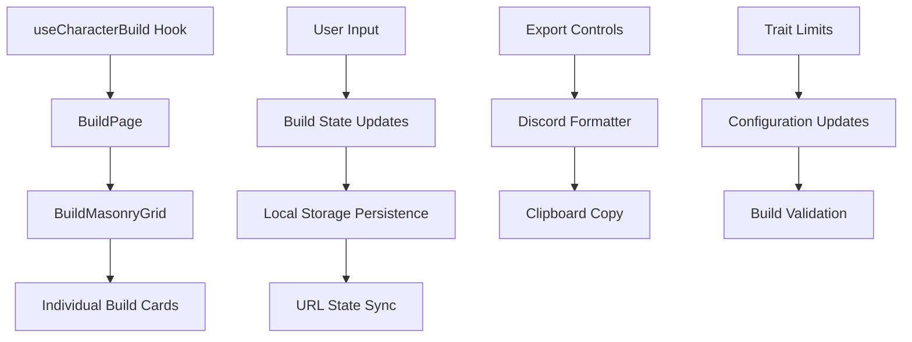

# Build Page Documentation

## 📋 Build Page Overview

### Purpose

The Build Page serves as the central character creation interface for the Lorerim Arcaneum project. It provides a comprehensive, tabbed interface for building and configuring character builds with all necessary components including race, birthsign, traits, religion, skills, and destiny paths.

### Core Functionality

- **Character Building**: Complete character creation workflow with all build components
- **Build Management**: Save, load, and export character builds
- **Configuration**: Customize trait limits and build parameters
- **Export Options**: Share builds via Discord with multiple detail levels
- **Responsive Layout**: Masonry grid layout that adapts to different screen sizes

### Data Structure

The build page operates on the `BuildState` interface:

```typescript
interface BuildState {
  v: number // Schema version
  name: string // Character name
  notes: string // RP flavor text
  race: string | null // EDID
  stone: string | null // EDID
  religion: string | null // EDID of followed deity
  traits: {
    regular: string[] // Array of EDIDs
    bonus: string[] // Array of EDIDs (requires game completion)
  }
  traitLimits: {
    regular: number // Maximum number of regular traits (default: 2)
    bonus: number // Maximum number of bonus traits (default: 1)
  }
  skills: {
    major: string[] // Array of EDIDs
    minor: string[] // Array of EDIDs
  }
  perks: {
    selected: Record<string, string[]> // skillId -> array of perk EDIDs
    ranks: Record<string, number> // perkId -> current rank
  }
  skillLevels: Record<string, number> // skillId -> minimum required level
  equipment: string[] // Array of EDIDs
  userProgress: {
    unlocks: string[] // Array of unlock IDs
  }
  destinyPath: string[] // Ordered array of DestinyNode ids
  attributeAssignments: {
    health: number
    stamina: number
    magicka: number
    level: number
    assignments: Record<number, 'health' | 'stamina' | 'magicka'>
  }
}
```

---

## 🏗️ Component Architecture

### Component Tree

Visual representation of the build page hierarchy:

```
BuildPage
├── BuildPageShell (shared)
│   ├── Title and Description
│   └── Container Layout
├── BuildControls
│   ├── Reset Button
│   └── ExportControls (Discord Export)
├── BuildResetConfirmDialog
├── Tabs
│   ├── TabsList
│   │   ├── Build Tab
│   │   └── Config Tab
│   └── TabsContent
│       ├── BuildMasonryGrid
│       │   ├── BasicInfoCard
│       │   ├── RaceSelectionCard
│       │   ├── BirthsignSelectionCard
│       │   ├── TraitSelectionCard
│       │   ├── ReligionSelectionCard
│       │   ├── AttributeAssignmentCard
│       │   ├── BuildPageSkillCard
│       │   ├── BuildPageDestinyCard
│       │   └── BuildSummaryCard
│       └── TraitLimitConfigCard
```

### Component Responsibilities

#### **BuildPage** (`pages/BuildPage.tsx`)

- **Purpose**: Primary orchestrator for character building workflow
- **Key Functions**:
  - Build state management via `useCharacterBuild` hook
  - Tab navigation and content switching
  - Build card organization and masonry layout
  - Reset confirmation dialog management
  - Trait limit configuration integration

#### **BuildPageShell** (`shared/components/playerCreation/BuildPageShell.tsx`)

- **Purpose**: Consistent page layout wrapper
- **Features**:
  - Responsive container with proper spacing
  - Title and description display
  - Consistent styling across build pages

#### **BuildMasonryGrid** (`components/BuildMasonryGrid.tsx`)

- **Purpose**: Responsive masonry layout for build cards
- **Features**:
  - Dynamic column calculation based on screen size
  - Proper vertical stacking of cards
  - Gap management and responsive breakpoints
  - Support for half-width and full-width cards

---

## 🎯 Build Item Order

### Tab Presentation Order

The build page presents items in a specific logical order as defined in the `buildCards` array:

1. **Basic Information** - Character name and notes
2. **Race** - Character race selection
3. **Birthsign** - Birthsign/stone selection
4. **Traits** - Regular and bonus trait selection
5. **Religion** - Deity/following selection
6. **Attributes** - Health, stamina, and magicka assignment
7. **Skills** - Major and minor skill selection with perks
8. **Destiny** - Destiny path progression
9. **Summary** - Build summary and overview

### Layout Strategy

- **Half-width cards**: Basic info, race, birthsign, traits, religion, attributes, skills, summary
- **Full-width cards**: Destiny (requires more space for path visualization)
- **Responsive behavior**: Cards stack appropriately on smaller screens

---

## 🔧 Technical Design

### Data Flow Architecture



### State Management

#### **Global Build State** (`useCharacterBuild` hook):

- `build`: Complete build state object
- `setBuildName`: Character name updates
- `setBuildNotes`: Character notes updates
- `resetBuild`: Complete build reset
- `updateBuild`: Partial build updates

#### **Local Component State**:

- `showConfirm`: Reset confirmation dialog state
- `traitLimits`: Trait limit configuration state
- `exportStatus`: Export operation feedback

### Data Transformation

#### **Build Export Process**:

```typescript
// Source: BuildState
const build: BuildState = {
  /* raw build data */
}

// Transformation: Hydration
const hydratedData = hydrateBuildData(build)

// Target: Discord Format
const formattedText = formatBuildForDiscord(hydratedData, buildLink)
```

---

## 🎨 UI/UX Design Patterns

### Visual Hierarchy

1. **Primary**: Build controls and main content area
2. **Secondary**: Individual build cards with clear sections
3. **Tertiary**: Configuration options and detailed information

### Tab System

- **Build Tab**: Main character building interface
- **Config Tab**: Advanced configuration options
- **Responsive**: Tabs adapt to available space

### Masonry Layout

- **Desktop**: Multi-column layout with optimal card distribution
- **Tablet**: Reduced columns with maintained readability
- **Mobile**: Single column with proper spacing

### Interaction Patterns

- **Card Selection**: Visual feedback for selected options
- **Export Feedback**: Success/error states with clear messaging
- **Reset Confirmation**: Modal dialog for destructive actions
- **Responsive Cards**: Cards adapt size based on content and screen

---

## 🔄 Reusable Components

### Shared Framework Components

#### **BuildPageShell**

- Generic page layout wrapper
- Consistent spacing and container management
- Title and description display

#### **useCharacterBuild Hook**

- Centralized build state management
- Local storage persistence
- URL state synchronization
- Build validation and updates

### Feature-Specific Components

#### **BuildMasonryGrid**

- **Reusability**: Can be adapted for other card-based layouts
- **Customization**: Configurable gap, responsive breakpoints
- **Accessibility**: Proper ARIA labels and keyboard navigation

#### **BuildControls**

- **Export Options**: Multiple Discord export formats
- **Reset Functionality**: Safe reset with confirmation
- **Visual Feedback**: Loading states and success indicators

#### **Individual Build Cards**

- **Consistent Interface**: Standardized card patterns
- **Selection Management**: Unified selection state handling
- **Responsive Design**: Adaptive layouts for different screen sizes

---

## 📊 Performance Considerations

### Data Loading

- **Build State**: Loaded from local storage on page initialization
- **Card Components**: Lazy-loaded as needed within masonry grid
- **Export Operations**: Asynchronous clipboard operations with fallbacks

### Rendering Optimization

- **Masonry Layout**: Efficient card distribution algorithm
- **Component Memoization**: Cards memoized to prevent unnecessary re-renders
- **State Updates**: Optimized updates to prevent cascading re-renders

### Export Performance

- **Debounced Operations**: Export operations debounced to prevent spam
- **Clipboard API**: Modern clipboard API with fallback for older browsers
- **Error Handling**: Graceful fallbacks for export failures

---

## 🧪 Testing Strategy

### Unit Tests

- Build state management and updates
- Export functionality and formatting
- Trait limit validation
- Component rendering and props validation

### Integration Tests

- End-to-end character building workflow
- Tab navigation and content switching
- Export and reset functionality
- Responsive design validation

### Accessibility Tests

- Keyboard navigation through build cards
- Screen reader compatibility
- Color contrast compliance
- ARIA label validation

---

## 🔮 Future Enhancements

### Planned Features

1. **Build Templates**: Pre-configured build templates for common archetypes
2. **Build Comparison**: Side-by-side comparison of different builds
3. **Advanced Export**: Additional export formats (JSON, XML, etc.)
4. **Build Sharing**: Direct sharing via generated URLs

### Technical Improvements

1. **Virtual Scrolling**: Implement virtual scrolling for large skill/perk lists
2. **Offline Support**: Enhanced offline capabilities with service workers
3. **Build Validation**: Real-time validation of build compatibility
4. **Performance Optimization**: Further optimization of masonry layout rendering

---

## 📚 Related Documentation

- [Build State Implementation](../docs/build-state-implementation.md)
- [Character Build Hook](../shared/hooks/useCharacterBuild.md)
- [Discord Export Formatter](../shared/utils/discordExportFormatter.md)
- [UI Component Library](../shared/ui/README.md)
- [Technical Specifications](../technical-spec.md)

---

## ✅ Documentation Checklist

### Required Sections

- [x] Feature Overview with clear purpose statement
- [x] Component Architecture with visual hierarchy
- [x] Build Item Order specification
- [x] Technical Design with data flow diagrams
- [x] UI/UX Design Patterns with responsive considerations
- [x] Reusable Components documentation
- [x] Performance Considerations
- [x] Testing Strategy
- [x] Future Enhancements roadmap
- [x] Related Documentation links

### Quality Standards

- [x] Clear, concise language throughout
- [x] Code examples for all interfaces and transformations
- [x] Visual diagrams for complex flows
- [x] Consistent emoji usage for section headers
- [x] Proper TypeScript interface definitions
- [x] Mermaid diagrams for data flow
- [x] Comprehensive component responsibility descriptions
- [x] Accessibility considerations documented
- [x] Performance optimization strategies outlined

---

_This documentation provides comprehensive coverage of the Build Page feature, ensuring maintainability and supporting future development efforts._
