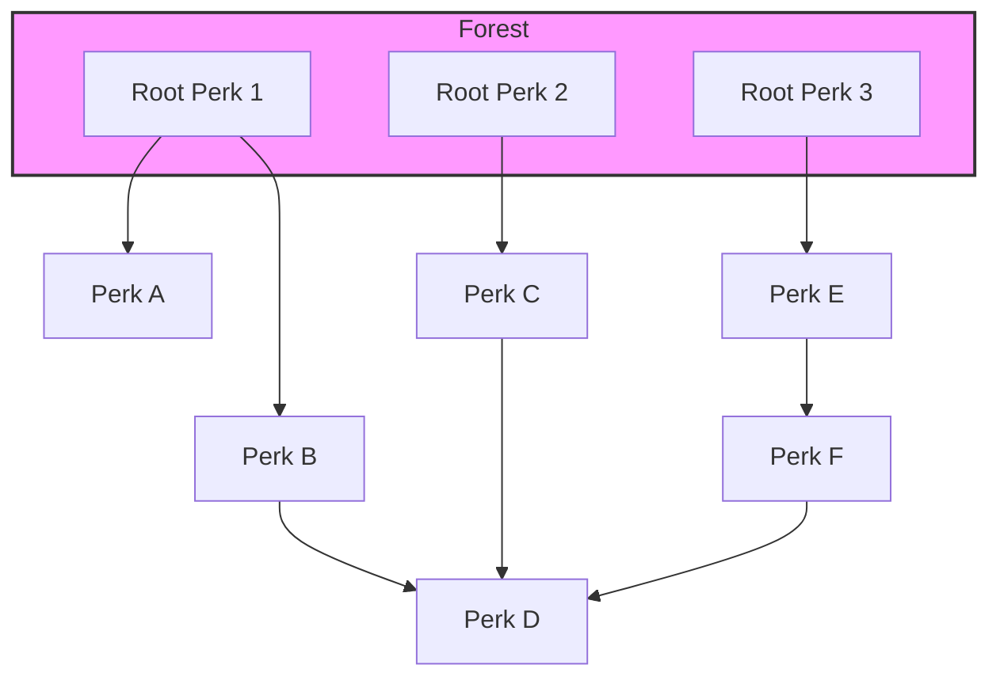

# Perks Feature Documentation

## Overview

The Perks feature implements a React Flow-based perk tree planner for character progression in Lorerim Arcaneum. It allows users to visualize and plan their character's perk progression across all skills.

## Architecture

### Components

- **UnifiedPerksPage**: Main page component that orchestrates the entire perk planner
- **SkillSelector**: Tab-based interface for selecting which skill tree to view
- **SummarySidebar**: Sidebar showing global overview of selected perks and requirements
- **PerkTreeCanvas**: React Flow canvas for visualizing perk trees
- **PerkNode**: Custom React Flow node component for individual perks

### Hooks

- **usePerks**: Manages loading and state of perk data from JSON
- **usePerkPlan**: Manages the global perk selection state and operations
- **useSkills**: Provides skill data and metadata

### Types

- **PerkNode**: Individual perk data structure
- **PerkEdge**: Edge data for prerequisite relationships
- **PerkPlan**: Global state for selected perks and requirements
- **Skill**: Skill metadata and selection state

## Data Flow

1. **Data Loading**: Perks are loaded from `/public/data/perks.json`
2. **Skill Selection**: User selects a skill via SkillSelector
3. **Tree Rendering**: PerkTreeCanvas renders the selected skill's perk tree
4. **Interaction**: Users can select/deselect perks and adjust ranks
5. **State Updates**: Changes are reflected in the global PerkPlan state
6. **Summary Updates**: SummarySidebar shows updated totals and requirements

## Features

### ✅ Implemented

- Skill selector with 18 Skyrim skills
- React Flow-based perk tree visualization
- Perk selection/deselection
- Multi-rank perk support
- Prerequisite relationship visualization
- Global summary sidebar
- Responsive design
- Hover cards with detailed perk information

### 🚧 Future Enhancements

- Perk tree layout algorithms
- Export/import perk plans
- Shareable URLs
- Mobile optimization
- Advanced filtering
- Perk recommendations

## Usage

Navigate to `/perks` to access the perk planner. The interface provides:

1. **Skill Tabs**: Click to switch between different skill trees
2. **Perk Nodes**: Click to select/deselect perks
3. **Rank Controls**: Use +/- buttons for multi-rank perks
4. **Summary Sidebar**: View totals and clear selections
5. **Canvas Controls**: Zoom, pan, and fit-to-view

## Technical Notes

- Uses React Flow for graph visualization
- Follows the established feature structure pattern
- Implements proper TypeScript types
- Uses ShadCN/UI components for consistency
- Follows Tailwind CSS styling guidelines

## 🌳 Perk Tree Layout Algorithm (Branch Level Rendering)

### Overview

To create a visually appealing and readable perk tree, we layout nodes by their **branch level** (tree depth), not just by x/y grid. This approach supports:
- Multiple roots (perks with no prerequisite perk in the same tree)
- Disconnected subtrees (e.g., unarmed path in One-Handed)
- Merges (nodes with multiple parents)

### Steps

1. **Identify Roots**
   - Any perk with no prerequisite perk (of type `PERK`) in the same tree is a root.
   - There may be multiple roots (disconnected subtrees).

2. **Build Forest (Set of Trees)**
   - For each root, traverse its descendants, assigning a branch level (depth).
   - If a node is reached from multiple roots, assign the shallowest level.
   - Guard against cycles (rare in perk trees).

3. **Layout by Level**
   - Each branch level gets its own vertical slot.
   - Siblings (nodes at the same level with the same parent) are spaced horizontally.
   - Disconnected subtrees are spaced apart horizontally.

4. **Draw Edges**
   - Edges are drawn between levels, creating clear vertical connections.

### Visual Example

### Key Points
- **Multiple roots**: Each disconnected branch starts at the top.
- **Merges**: Nodes like `Perk D` (`B2`) can have multiple parents.
- **Disconnected subtrees**: Each root and its descendants are spaced apart.
- **Branch level**: Each row in the diagram is a branch level (depth).

### Implementation Notes
- The algorithm traverses from all roots, assigning levels and positions.
- Nodes are only placed once (at the shallowest level if reached from multiple paths).
- The layout is robust to disconnected trees and merges.

---
