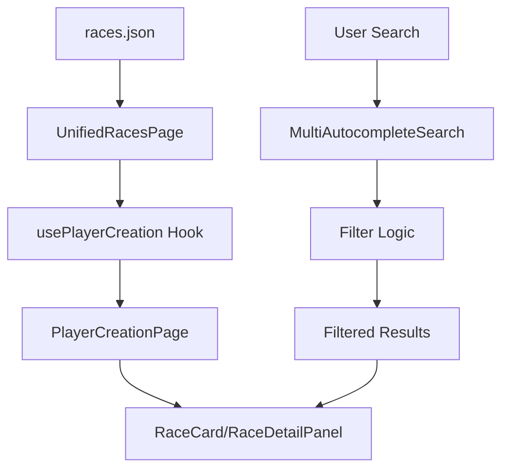

# Races Feature Documentation

## 🎯 Feature Overview

The Races feature provides a comprehensive interface for browsing and selecting character races in the Lorerim Arcaneum application. It leverages a shared player creation framework to deliver a consistent, searchable, and filterable experience for race selection.

### Core Functionality
- **Race Browsing**: Display all available races in grid/list view modes
- **Advanced Search**: Multi-category autocomplete search by traits and effect types
- **Detailed Information**: Comprehensive race details including stats, traits, and descriptions
- **Filtering**: Tag-based filtering system for traits and effect types
- **Responsive Design**: Mobile-friendly interface with adaptive layouts

### Data Structure
Races are defined with the following structure:
```typescript
interface Race {
  id: string
  name: string
  description: string
  traits: RaceTrait[]
  startingStats: StartingStats
}
```

> **📊 Visual Needed**: Entity Relationship Diagram showing Race, RaceTrait, and StartingStats relationships with cardinality and key fields highlighted.

## 🏗️ Component Architecture

### Component Tree
```
UnifiedRacesPage
├── PlayerCreationPage (shared)
│   ├── Header (title + description)
│   ├── Search & Filters
│   │   ├── MultiAutocompleteSearch
│   │   │   └── AutocompleteSearch (multiple instances)
│   │   ├── SelectedTags
│   │   └── ViewModeToggle (grid/list)
│   ├── ItemGrid
│   │   └── RaceCard (custom render)
│   └── DetailPanel
│       └── RaceDetailPanel (custom render)
└── Loading/Error States
```

> **📊 Visual Needed**: Component hierarchy diagram with:
> - Color coding for shared vs. feature-specific components
> - Data flow arrows showing props and state
> - Responsive breakpoint indicators
> - Z-index layering visualization

### Component Responsibilities

#### **UnifiedRacesPage** (`pages/UnifiedRacesPage.tsx`)
- **Purpose**: Main page component that orchestrates the race selection interface
- **Key Functions**:
  - Data fetching from `public/data/races.json`
  - Data transformation from `Race` to `PlayerCreationItem` format
  - Search category generation for autocomplete
  - Custom render functions for race-specific components
  - Error handling and loading states

#### **RaceCard** (`components/RaceCard.tsx`)
- **Purpose**: Compact race representation in grid/list views
- **Features**:
  - Visual race type indicators (Human/Elf/Beast)
  - Trait icons with color coding
  - Selection state management
  - Responsive design with hover effects

> **📊 Visual Needed**: RaceCard component mockup showing:
> - Different states (default, hover, selected)
> - Icon placement and color coding
> - Responsive breakpoints
> - Accessibility indicators

#### **RaceDetailPanel** (`components/RaceDetailPanel.tsx`)
- **Purpose**: Comprehensive race information display
- **Features**:
  - Starting stats visualization with progress bars
  - Detailed trait descriptions with effect information
  - Icon-based trait categorization
  - Responsive layout for different screen sizes

> **📊 Visual Needed**: RaceDetailPanel layout diagram showing:
> - Information hierarchy and sections
> - Progress bar visualization for stats
> - Trait categorization layout
> - Responsive behavior across screen sizes

#### **PageShell** (`components/PageShell.tsx`)
- **Purpose**: Reusable page layout wrapper
- **Features**:
  - Consistent header structure
  - Responsive content area
  - Theme-aware styling

## 🔧 Technical Design

### Data Flow Architecture



> **📊 Visual Needed**: Enhanced data flow diagram showing:
> - State management boundaries
> - Data transformation points
> - Performance optimization checkpoints
> - Error handling paths

### State Management

The feature uses a combination of local state and shared hooks:

1. **Local State** (`UnifiedRacesPage`):
   - `races`: Raw race data from JSON
   - `loading`: Data fetching state
   - `error`: Error handling state

2. **Shared State** (`usePlayerCreation`):
   - `selectedItem`: Currently selected race
   - `viewMode`: Grid or list view preference
   - `currentFilters`: Active search and filter state
   - `filteredItems`: Computed filtered results

> **📊 Visual Needed**: State management diagram showing:
> - State ownership and boundaries
> - State update triggers
> - State synchronization points
> - Performance implications

### Data Transformation

The feature transforms race data between two formats:

**Source Format** (`Race`):
```typescript
{
  id: "nord",
  name: "Nord",
  description: "Hardy warriors...",
  traits: [...],
  startingStats: {...}
}
```

**Target Format** (`PlayerCreationItem`):
```typescript
{
  id: "nord",
  name: "Nord",
  description: "Hardy warriors...",
  tags: ["Frost Resistance", "Battle Cry"],
  effects: [...],
  category: "Human"
}
```

> **📊 Visual Needed**: Data transformation flow diagram showing:
> - Field mapping relationships
> - Data enrichment process
> - Validation checkpoints
> - Error handling for malformed data

### Search & Filtering System

#### Search Categories
- **Traits**: Search by specific racial traits (e.g., "Frost Resistance")
- **Effect Types**: Filter by effect categories (resistance, ability, passive)

#### Filter Logic
```typescript
// Multi-layered filtering
1. Text Search: name, description, trait names
2. Type Filter: Human/Elf/Beast categorization
3. Tag Filter: Trait-based filtering with effect types
```

> **📊 Visual Needed**: Search and filtering system diagram showing:
> - Filter pipeline stages
> - Search algorithm flow
> - Performance optimization points
> - User interaction patterns

## 🎨 UI/UX Design Patterns

### Visual Hierarchy
1. **Primary**: Race name and type
2. **Secondary**: Description and key traits
3. **Tertiary**: Detailed stats and full trait list

### Icon System
- **Trait Icons**: Color-coded by effect type
  - 🔥 Fire effects (red)
  - ❄️ Frost effects (blue)
  - ⚡ Magic effects (purple)
  - 🛡️ Resistance effects (green)
  - 🎯 Ability effects (orange)

> **📊 Visual Needed**: Icon system reference diagram showing:
> - Icon-to-effect type mapping
> - Color palette and accessibility considerations
> - Icon sizing and spacing guidelines
> - Fallback icon strategies

### Responsive Design
- **Desktop**: 3-column grid with sidebar detail panel
- **Tablet**: 2-column grid with bottom detail panel
- **Mobile**: Single column with modal detail panel

> **📊 Visual Needed**: Responsive design breakpoint diagram showing:
> - Layout changes at each breakpoint
> - Component behavior adaptations
> - Touch target sizing
> - Navigation pattern changes

### Interaction Patterns
- **Hover Effects**: Subtle scaling and shadow changes
- **Selection States**: Ring borders and visual indicators
- **Loading States**: Skeleton screens and spinners
- **Error States**: Clear messaging with retry options

> **📊 Visual Needed**: Interaction state diagram showing:
> - State transition flows
> - User feedback mechanisms
> - Accessibility considerations
> - Performance impact of animations

## 🔄 Reusable Components

### Shared Player Creation Framework

The races feature leverages a comprehensive shared framework:

#### **PlayerCreationPage**
- Generic layout for categorized item selection
- Built-in search, filtering, and view mode management
- Customizable render functions for item cards and detail panels

#### **MultiAutocompleteSearch**
- Multi-category search interface
- Tag-based filtering system
- Keyboard navigation support

#### **ItemGrid**
- Responsive grid/list view switching
- Selection state management
- Empty state handling

#### **DetailPanel**
- Sticky positioning for desktop layouts
- Consistent information architecture
- Close/back navigation support

> **📊 Visual Needed**: Shared component architecture diagram showing:
> - Component relationships and dependencies
> - Customization points and extension patterns
> - Reusability across different features
> - Performance characteristics

### Race-Specific Components

#### **RaceCard**
- **Reusability**: Can be adapted for other entity types
- **Customization**: Icon mapping and color schemes
- **Accessibility**: ARIA labels and keyboard navigation

#### **RaceDetailPanel**
- **Extensibility**: Modular stat and trait sections
- **Data Visualization**: Progress bars for numerical stats
- **Information Architecture**: Hierarchical content organization

## 📊 Performance Considerations

### Data Loading
- **Runtime Fetching**: Races loaded from JSON at component mount
- **Error Boundaries**: Graceful fallbacks for network issues
- **Loading States**: User feedback during data fetching

### Rendering Optimization
- **Memoization**: Filtered results cached with `useMemo`
- **Virtual Scrolling**: Large lists handled efficiently
- **Lazy Loading**: Images and heavy content loaded on demand

### Search Performance
- **Debounced Input**: Search queries optimized for performance
- **Indexed Filtering**: Pre-computed search indices
- **Cached Results**: Filtered results memoized

> **📊 Visual Needed**: Performance optimization diagram showing:
> - Caching strategies and invalidation
> - Memory usage patterns
> - Network request optimization
> - User experience impact metrics

## 🧪 Testing Strategy

### Unit Tests
- Component rendering and props validation
- Data transformation logic
- Filter and search functionality

### Integration Tests
- End-to-end race selection flow
- Search and filter interactions
- Responsive design breakpoints

### Accessibility Tests
- Screen reader compatibility
- Keyboard navigation
- Color contrast compliance

> **📊 Visual Needed**: Testing strategy diagram showing:
> - Test coverage areas
> - Test execution flow
> - Quality gates and thresholds
> - Continuous integration pipeline

## 🔮 Future Enhancements

### Planned Features
1. **Race Comparison**: Side-by-side race comparison tool
2. **Favorites System**: Save preferred races for quick access
3. **Advanced Filtering**: Multi-select filters and saved searches
4. **Race Recommendations**: AI-powered race suggestions based on playstyle

> **📊 Visual Needed**: Feature roadmap diagram showing:
> - Feature dependencies and prerequisites
> - Development phases and milestones
> - Resource allocation and priorities
> - Success metrics and KPIs

### Technical Improvements
1. **Data Caching**: Implement service worker for offline access
2. **Real-time Updates**: WebSocket integration for live data
3. **Analytics**: User behavior tracking for optimization
4. **Internationalization**: Multi-language support

> **📊 Visual Needed**: Technical architecture evolution diagram showing:
> - Current vs. future architecture
> - Migration paths and strategies
> - Risk assessment and mitigation
> - Performance impact analysis

## 📚 Related Documentation

- [Player Creation Framework](../shared/components/playerCreation/README.md)
- [UI Component Library](../shared/ui/README.md)
- [Data Schema Documentation](../../../docs/technical-spec.md)
- [Z-Index System](../../../docs/z-index-system.md)

---

*This documentation is maintained as part of the Lorerim Arcaneum project. For questions or contributions, please refer to the project's contribution guidelines.* 