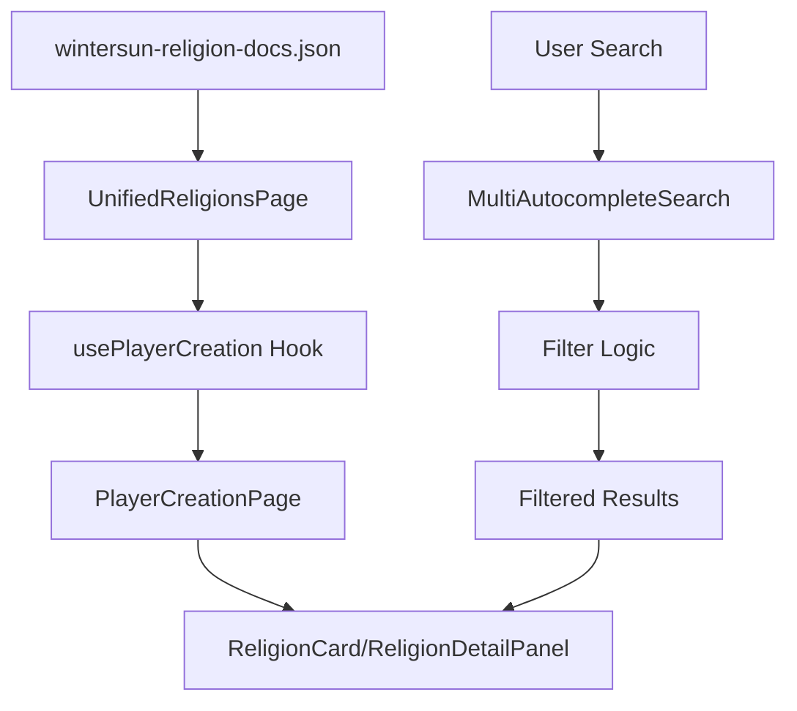

# Religions Feature Documentation

## 🎯 Feature Overview

The Religions feature provides a comprehensive interface for browsing and selecting character religions in the Lorerim Arcaneum application. It leverages a shared player creation framework to deliver a consistent, searchable, and filterable experience for religion selection.

### Core Functionality
- **Religion Browsing**: Display all available religions in grid/list view modes
- **Advanced Search**: Multi-category autocomplete search by pantheons, effect types, and tags
- **Detailed Information**: Comprehensive religion details including blessings, tenets, follower/devotee powers, and restrictions
- **Filtering**: Tag-based filtering system for pantheons, effect types, and tags
- **Responsive Design**: Mobile-friendly interface with adaptive layouts
- **Markdown Support**: Rich text rendering with support for bold formatting, lists, and emphasis

### Data Structure
Religions are defined with the following structure:
```typescript
interface Religion {
  name: string
  type: string
  blessing: ReligionSpell
  boon1: ReligionSpell // Follower power
  boon2: ReligionSpell // Devotee power
  tenet: ReligionTenet
  favoredRaces: string[]
  worshipRestrictions: string[]
}
```

## 🏗️ Component Architecture

### Component Tree
```
UnifiedReligionsPage
├── PlayerCreationPage (shared)
│   ├── Header (title + description)
│   ├── Search & Filters
│   │   ├── MultiAutocompleteSearch
│   │   │   └── AutocompleteSearch (multiple instances)
│   │   ├── SelectedTags
│   │   └── ViewModeToggle (grid/list)
│   ├── ItemGrid
│   │   └── ReligionCard (custom render)
│   └── DetailPanel
│       └── ReligionDetailPanel (custom render)
└── Loading/Error States
```

### Component Responsibilities

#### **UnifiedReligionsPage** (`pages/UnifiedReligionsPage.tsx`)
- **Purpose**: Main page component that orchestrates the religion selection interface
- **Key Functions**:
  - Data fetching from `public/data/wintersun-religion-docs.json`
  - Data transformation from `Religion` to `PlayerCreationItem` format
  - Search category generation for autocomplete (Pantheons, Effect Types, Tags)
  - Custom render functions for religion-specific components
  - Error handling and loading states

#### **ReligionCard** (`components/ReligionCard.tsx`)
- **Purpose**: Compact religion representation in grid/list views
- **Features**:
  - Visual pantheon indicators with icons and color coding
  - Tag display with overflow handling
  - Selection state management
  - Responsive design with hover effects

#### **ReligionDetailPanel** (`components/ReligionDetailPanel.tsx`)
- **Purpose**: Comprehensive religion information display with tabbed interface
- **Features**:
  - **Follower Tab**: Tenets, follower powers, and devotee powers
  - **Blessing Tab**: Shrine blessings available to all players
  - Effect details with magnitude and duration
  - Markdown rendering for descriptions
  - Restrictions and favored races display
  - Tag categorization and display

## 🔧 Technical Design

### Data Flow Architecture



### State Management

The feature uses a combination of local state and shared hooks:

1. **Local State** (`UnifiedReligionsPage`):
   - `religions`: Raw religion data from JSON
   - `loading`: Data fetching state
   - `error`: Error handling state

2. **Shared State** (`usePlayerCreation`):
   - `selectedItem`: Currently selected religion
   - `viewMode`: Grid or list view preference
   - `currentFilters`: Active search and filter state
   - `filteredItems`: Computed filtered results

### Data Transformation

The feature transforms religion data between two formats:

**Source Format** (`Religion`):
```typescript
{
  name: "Akatosh",
  type: "Divine",
  blessing: {...},
  boon1: {...},
  boon2: {...},
  tenet: {...},
  favoredRaces: [...],
  worshipRestrictions: [...]
}
```

**Target Format** (`PlayerCreationItem`):
```typescript
{
  id: "akatosh",
  name: "Akatosh",
  description: "Fulfill your destiny...",
  tags: ["Divine", "Quest Required"],
  effects: [...],
  category: "Divine"
}
```

### Search & Filtering System

#### Search Categories
- **Pantheons**: Search by pantheon types (Divine, Daedric, Yokudan, Custom)
- **Effect Types**: Filter by effect categories (Resist Magic, Fortify Health, etc.)
- **Tags**: Filter by religion tags (Quest Required, Alignment Restricted, etc.)

#### Filter Logic
```typescript
// Multi-layered filtering
1. Text Search: name, description, effect names
2. Pantheon Filter: Divine/Daedric/Yokudan/Custom categorization
3. Tag Filter: Tag-based filtering with restrictions and requirements
```

## 🎨 UI/UX Design Patterns

### Visual Hierarchy
1. **Primary**: Religion name and pantheon
2. **Secondary**: Tabbed interface (Follower vs Blessing)
3. **Tertiary**: Detailed content within each tab

### Icon System
- **Pantheon Icons**: Color-coded by pantheon
  - 🕊️ Divine (blue)
  - 🔥 Daedric (red)
  - ⚔️ Yokudan (orange)
  - ✨ Custom (purple)

- **Tab Icons**: Visual indicators for content types
  - 🙏 Follower tab (blue dot) - Tenets and powers
  - ✨ Blessing tab (yellow dot) - Shrine blessings
- **Effect Icons**: Color-coded by effect type
  - 🎯 Follower powers (blue)
  - 🔥 Devotee powers (purple)
  - 🔒 Restrictions (gray)

### Responsive Design
- **Desktop**: 3-column grid with sidebar detail panel
- **Tablet**: 2-column grid with bottom detail panel
- **Mobile**: Single column with modal detail panel

### Interaction Patterns
- **Hover Effects**: Subtle scaling and shadow changes
- **Selection States**: Ring borders and visual indicators
- **Loading States**: Skeleton screens and spinners
- **Error States**: Clear messaging with retry options

## 🔄 Reusable Components

### Shared Player Creation Framework

The religions feature leverages the same comprehensive shared framework as races and traits:

#### **PlayerCreationPage**
- Generic layout for categorized item selection
- Built-in search, filtering, and view mode management
- Customizable render functions for item cards and detail panels

#### **MultiAutocompleteSearch**
- Multi-category search interface
- Tag-based filtering system
- Keyboard navigation support

#### **ItemGrid**
- Responsive grid/list view switching
- Selection state management
- Empty state handling

### Religion-Specific Components

#### **ReligionCard**
- **Reusability**: Can be adapted for other entity types
- **Customization**: Icon mapping and color schemes
- **Accessibility**: ARIA labels and keyboard navigation

#### **ReligionDetailPanel**
- **Extensibility**: Modular blessing, tenet, and power sections
- **Data Visualization**: Effect icons and color coding
- **Information Architecture**: Hierarchical content organization

## 📊 Performance Considerations

### Data Loading
- **Runtime Fetching**: Religions loaded from JSON at component mount
- **Error Boundaries**: Graceful fallbacks for network issues
- **Loading States**: User feedback during data fetching

### Rendering Optimization
- **Memoization**: Filtered results cached with `useMemo`
- **Virtual Scrolling**: Large lists handled efficiently
- **Lazy Loading**: Images and heavy content loaded on demand

### Search Performance
- **Debounced Input**: Search queries optimized for performance
- **Indexed Filtering**: Pre-computed search indices
- **Cached Results**: Filtered results memoized

## 🧪 Testing Strategy

### Unit Tests
- Component rendering and props validation
- Data transformation logic
- Filter and search functionality

### Integration Tests
- End-to-end religion selection flow
- Search and filter interactions
- Responsive design breakpoints

### Accessibility Tests
- Screen reader compatibility
- Keyboard navigation
- Color contrast compliance

## 🔮 Future Enhancements

### Planned Features
1. **Religion Comparison**: Side-by-side religion comparison tool
2. **Favorites System**: Save preferred religions for quick access
3. **Advanced Filtering**: Multi-select filters and saved searches
4. **Religion Recommendations**: AI-powered religion suggestions based on playstyle
5. **Favor Tracking**: Visual indicators for favor gain/loss mechanics
6. **Quest Integration**: Link religions to required quests

### Technical Improvements
1. **Data Caching**: Implement service worker for offline access
2. **Real-time Updates**: WebSocket integration for live data
3. **Analytics**: User behavior tracking for optimization
4. **Internationalization**: Multi-language support

## 📚 Related Documentation

- [Player Creation Framework](../shared/components/playerCreation/README.md)
- [UI Component Library](../shared/ui/README.md)
- [Data Schema Documentation](../../../docs/technical-spec.md)
- [Z-Index System](../../../docs/z-index-system.md)

---

*This documentation is maintained as part of the Lorerim Arcaneum project. For questions or contributions, please refer to the project's contribution guidelines.* 