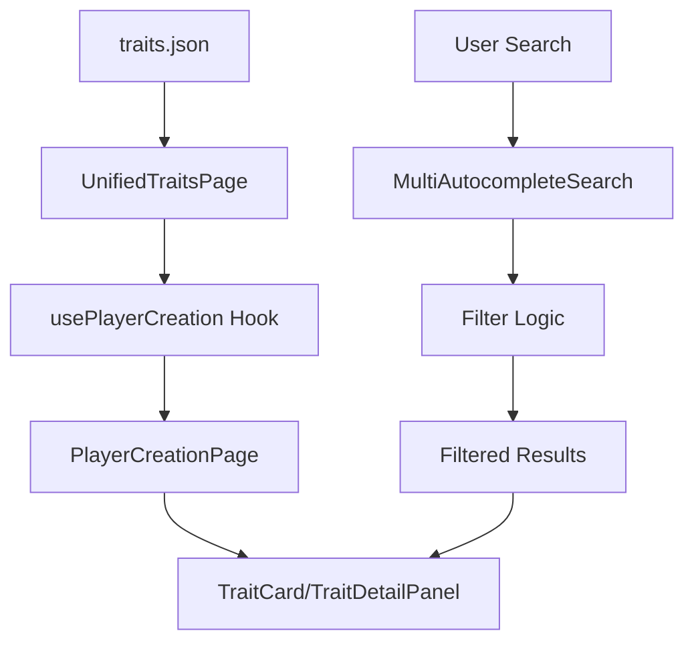

# Traits Feature Documentation

## 🎯 Feature Overview

The Traits feature provides a comprehensive interface for browsing and selecting character traits in the Lorerim Arcaneum application. It leverages a shared player creation framework to deliver a consistent, searchable, and filterable experience for trait selection.

### Core Functionality
- **Trait Browsing**: Display all available traits in grid/list view modes
- **Advanced Search**: Multi-category autocomplete search by categories, effect types, and tags
- **Detailed Information**: Comprehensive trait details including effects, spell information, and technical details
- **Filtering**: Tag-based filtering system for categories, effect types, and tags
- **Responsive Design**: Mobile-friendly interface with adaptive layouts
- **Markdown Support**: Rich text rendering with support for bold formatting, lists, and emphasis

### Data Structure
Traits are defined with the following structure:
```typescript
interface Trait {
  name: string
  description: string
  edid: string
  formId: string
  spell: TraitSpell
  effects: TraitEffect[]
  category: string
  tags: string[]
  diagram: string
}
```

## 🏗️ Component Architecture

### Component Tree
```
UnifiedTraitsPage
├── PlayerCreationPage (shared)
│   ├── Header (title + description)
│   ├── Search & Filters
│   │   ├── MultiAutocompleteSearch
│   │   │   └── AutocompleteSearch (multiple instances)
│   │   ├── SelectedTags
│   │   └── ViewModeToggle (grid/list)
│   ├── ItemGrid
│   │   └── TraitCard (custom render)
│   └── DetailPanel
│       └── TraitDetailPanel (custom render)
└── Loading/Error States
```

### Component Responsibilities

#### **UnifiedTraitsPage** (`pages/UnifiedTraitsPage.tsx`)
- **Purpose**: Main page component that orchestrates the trait selection interface
- **Key Functions**:
  - Data fetching from `public/data/traits.json`
  - Data transformation from `Trait` to `PlayerCreationItem` format
  - Search category generation for autocomplete (Categories, Effect Types, Tags)
  - Custom render functions for trait-specific components
  - Error handling and loading states

#### **TraitCard** (`components/TraitCard.tsx`)
- **Purpose**: Compact trait representation in grid/list views
- **Features**:
  - Visual category indicators with icons and color coding
  - Tag display with overflow handling
  - Selection state management
  - Responsive design with hover effects

#### **TraitDetailPanel** (`components/TraitDetailPanel.tsx`)
- **Purpose**: Clean, focused trait information display (MVP)
- **Features**:
  - Markdown-rendered descriptions with highlighted values
  - Tag categorization and display
  - Category icon and badge
  - Simplified layout for better readability

## 🔧 Technical Design

### Data Flow Architecture



### State Management

The feature uses a combination of local state and shared hooks:

1. **Local State** (`UnifiedTraitsPage`):
   - `traits`: Raw trait data from JSON
   - `loading`: Data fetching state
   - `error`: Error handling state

2. **Shared State** (`usePlayerCreation`):
   - `selectedItem`: Currently selected trait
   - `viewMode`: Grid or list view preference
   - `currentFilters`: Active search and filter state
   - `filteredItems`: Computed filtered results

### Data Transformation

The feature transforms trait data between two formats:

**Source Format** (`Trait`):
```typescript
{
  name: "Acoustic Arcanist",
  description: "Your magic flows through melody...",
  edid: "LoreTraits_AcousticArcanistAb",
  effects: [...],
  category: "magic",
  tags: ["magic"]
}
```

**Target Format** (`PlayerCreationItem`):
```typescript
{
  id: "LoreTraits_AcousticArcanistAb",
  name: "Acoustic Arcanist",
  description: "Your magic flows through melody...",
  tags: ["magic"],
  effects: [...],
  category: "magic"
}
```

### Search & Filtering System

#### Search Categories
- **Categories**: Search by trait categories (magic, combat, stealth, crafting, survival)
- **Effect Types**: Filter by effect categories (damage_dealt, special_effect, resistance, etc.)
- **Tags**: Filter by trait tags

#### Filter Logic
```typescript
// Multi-layered filtering
1. Text Search: name, description, effect types
2. Category Filter: Magic/Combat/Stealth/Crafting/Survival
3. Tag Filter: Tag-based filtering with effect types
```

## 🎨 UI/UX Design Patterns

### Visual Hierarchy
1. **Primary**: Trait name and category
2. **Secondary**: Description and key effects (with markdown formatting)
3. **Tertiary**: Detailed effects and technical information

### Markdown Rendering
The feature includes comprehensive markdown support for trait descriptions:
- **Bold Text**: `***text***` renders as highlighted values with background color
- **Emphasis**: `*text*` renders as italic text
- **Lists**: Support for ordered and unordered lists
- **Code**: Inline code formatting for technical terms
- **Custom Styling**: Consistent with the application's design system

### Icon System
- **Category Icons**: Color-coded by category
  - ✨ Magic (purple)
  - ⚔️ Combat (red)
  - 👤 Stealth (gray)
  - 🔨 Crafting (orange)
  - 🌿 Survival (green)

- **Effect Icons**: Color-coded by effect type
  - ⚔️ Damage effects (red)
  - ✨ Special effects (purple)
  - 🛡️ Resistance effects (blue)
  - 💚 Healing effects (green)
  - 🏃 Movement effects (yellow)

### Responsive Design
- **Desktop**: 3-column grid with sidebar detail panel
- **Tablet**: 2-column grid with bottom detail panel
- **Mobile**: Single column with modal detail panel

### Interaction Patterns
- **Hover Effects**: Subtle scaling and shadow changes
- **Selection States**: Ring borders and visual indicators
- **Loading States**: Skeleton screens and spinners
- **Error States**: Clear messaging with retry options

## 🔄 Reusable Components

### Shared Player Creation Framework

The traits feature leverages the same comprehensive shared framework as races:

#### **PlayerCreationPage**
- Generic layout for categorized item selection
- Built-in search, filtering, and view mode management
- Customizable render functions for item cards and detail panels

#### **MultiAutocompleteSearch**
- Multi-category search interface
- Tag-based filtering system
- Keyboard navigation support

#### **ItemGrid**
- Responsive grid/list view switching
- Selection state management
- Empty state handling

### Trait-Specific Components

#### **TraitCard**
- **Reusability**: Can be adapted for other entity types
- **Customization**: Icon mapping and color schemes
- **Accessibility**: ARIA labels and keyboard navigation

#### **TraitDetailPanel**
- **Extensibility**: Modular effect and spell sections
- **Data Visualization**: Effect icons and color coding
- **Information Architecture**: Hierarchical content organization

## 📊 Performance Considerations

### Data Loading
- **Runtime Fetching**: Traits loaded from JSON at component mount
- **Error Boundaries**: Graceful fallbacks for network issues
- **Loading States**: User feedback during data fetching

### Rendering Optimization
- **Memoization**: Filtered results cached with `useMemo`
- **Virtual Scrolling**: Large lists handled efficiently
- **Lazy Loading**: Images and heavy content loaded on demand

### Search Performance
- **Debounced Input**: Search queries optimized for performance
- **Indexed Filtering**: Pre-computed search indices
- **Cached Results**: Filtered results memoized

## 🧪 Testing Strategy

### Unit Tests
- Component rendering and props validation
- Data transformation logic
- Filter and search functionality

### Integration Tests
- End-to-end trait selection flow
- Search and filter interactions
- Responsive design breakpoints

### Accessibility Tests
- Screen reader compatibility
- Keyboard navigation
- Color contrast compliance

## 🔮 Future Enhancements

### Planned Features
1. **Enhanced Data Display**: Add back spell information, effects, and technical details
2. **Trait Comparison**: Side-by-side trait comparison tool
3. **Favorites System**: Save preferred traits for quick access
4. **Advanced Filtering**: Multi-select filters and saved searches
5. **Trait Recommendations**: AI-powered trait suggestions based on playstyle
6. **Trait Synergies**: Show how traits work together

### Technical Improvements
1. **Data Caching**: Implement service worker for offline access
2. **Real-time Updates**: WebSocket integration for live data
3. **Analytics**: User behavior tracking for optimization
4. **Internationalization**: Multi-language support

## 📚 Related Documentation

- [Player Creation Framework](../shared/components/playerCreation/README.md)
- [UI Component Library](../shared/ui/README.md)
- [Data Schema Documentation](../../../docs/technical-spec.md)
- [Z-Index System](../../../docs/z-index-system.md)

---

*This documentation is maintained as part of the Lorerim Arcaneum project. For questions or contributions, please refer to the project's contribution guidelines.* 