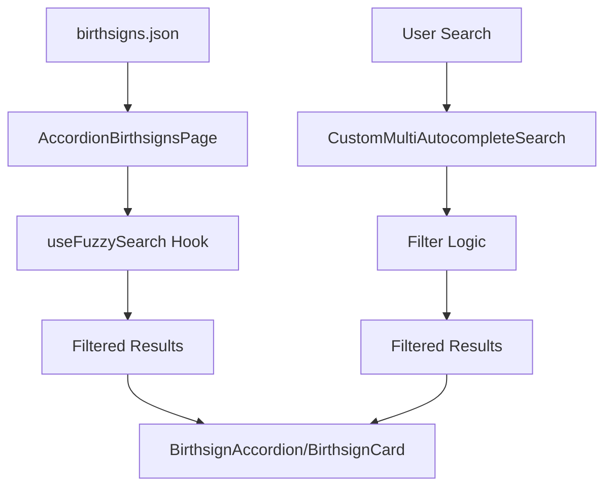

# Unit of Work: Documentation-Implementation Synchronization

## 📋 Overview

Fix the critical mismatch between documentation and actual implementation by either creating the missing `UnifiedBirthsignsPage` or updating documentation to reflect the current `AccordionBirthsignsPage` implementation.

## 🎯 Objective

Ensure documentation accurately reflects the current implementation and provides clear guidance for developers working on the birthsigns feature.

## 📊 Current Issues

- **Documentation references `UnifiedBirthsignsPage`** that doesn't exist
- **Main export points to non-existent file** in `src/features/birthsigns/index.ts`
- **Component tree documentation is outdated** and doesn't match actual implementation
- **Data flow diagrams reference wrong components**
- **Confusing for new developers** trying to understand the feature
- **Inconsistent naming** between documentation and code

## 🔧 Proposed Changes

### Option A: Create UnifiedBirthsignsPage (Recommended)

#### 1. Create the Missing UnifiedBirthsignsPage

#### `src/features/birthsigns/pages/UnifiedBirthsignsPage.tsx`

```typescript
import { PlayerCreationPage } from '@/shared/components/playerCreation'
import type { PlayerCreationItem } from '@/shared/components/playerCreation/types'
import { useEffect, useMemo, useState } from 'react'
import { BirthsignCard, BirthsignDetailPanel } from '../components'
import { useFuzzySearch } from '../hooks'
import type { Birthsign } from '../types'
import { getAllGroups, getAllStats, transformBirthsignToPlayerCreationItem } from '../utils'

export function UnifiedBirthsignsPage() {
  const [birthsigns, setBirthsigns] = useState<Birthsign[]>([])
  const [loading, setLoading] = useState(true)
  const [error, setError] = useState<string | null>(null)
  const [selectedItem, setSelectedItem] = useState<PlayerCreationItem | null>(null)

  // Data fetching
  useEffect(() => {
    async function fetchBirthsigns() {
      try {
        setLoading(true)
        const res = await fetch(`${import.meta.env.BASE_URL}data/birthsigns.json`)
        if (!res.ok) throw new Error('Failed to fetch birthsign data')
        const data = await res.json()
        setBirthsigns(data)
      } catch (err) {
        setError('Failed to load birthsign data')
        console.error('Error loading birthsigns:', err)
      } finally {
        setLoading(false)
      }
    }
    fetchBirthsigns()
  }, [])

  // Transform birthsigns to PlayerCreationItem format
  const birthsignItems: PlayerCreationItem[] = useMemo(() => {
    return birthsigns.map(transformBirthsignToPlayerCreationItem)
  }, [birthsigns])

  // Generate search categories
  const searchCategories = useMemo(() => {
    const groups = getAllGroups(birthsigns)
    const stats = getAllStats(birthsigns)

    return [
      {
        id: 'fuzzy-search',
        name: 'Fuzzy Search',
        placeholder: 'Search by name, description, or abilities...',
        options: [],
      },
      {
        id: 'groups',
        name: 'Birthsign Groups',
        placeholder: 'Search by birthsign group...',
        options: groups.map(group => ({
          id: `group-${group}`,
          label: group,
          value: group,
          category: 'Birthsign Groups',
          description: `Birthsigns from ${group} group`,
        })),
      },
      {
        id: 'stats',
        name: 'Stats & Skills',
        placeholder: 'Search by stats and skills...',
        options: stats.map(stat => ({
          id: `stat-${stat}`,
          label: stat.replace(/_/g, ' ').replace(/\b\w/g, l => l.toUpperCase()),
          value: stat,
          category: 'Stats & Skills',
          description: `Birthsigns that affect ${stat}`,
        })),
      },
    ]
  }, [birthsigns])

  // Handle item selection
  const handleItemSelect = (item: PlayerCreationItem) => {
    setSelectedItem(item)
  }

  // Handle filters change
  const handleFiltersChange = (filters: any) => {
    // Implement filter logic
  }

  // Handle search
  const handleSearch = (query: string) => {
    // Implement search logic
  }

  // Handle tag selection
  const handleTagSelect = (tag: any) => {
    // Implement tag selection logic
  }

  // Handle tag removal
  const handleTagRemove = (tagId: string) => {
    // Implement tag removal logic
  }

  // Render birthsign card
  const renderBirthsignCard = (item: PlayerCreationItem, isSelected: boolean) => {
    const originalBirthsign = birthsigns.find(birthsign =>
      birthsign.name.toLowerCase().replace(/\s+/g, '-') === item.id
    )

    if (!originalBirthsign) return null

    return (
      <BirthsignCard
        birthsign={originalBirthsign}
        item={item}
        isSelected={isSelected}
        onClick={() => handleItemSelect(item)}
      />
    )
  }

  // Render birthsign detail panel
  const renderBirthsignDetailPanel = (item: PlayerCreationItem) => {
    const originalBirthsign = birthsigns.find(birthsign =>
      birthsign.name.toLowerCase().replace(/\s+/g, '-') === item.id
    )

    if (!originalBirthsign) return null

    return (
      <BirthsignDetailPanel
        birthsign={originalBirthsign}
        item={item}
      />
    )
  }

  if (loading) {
    return (
      <div className="min-h-screen bg-background flex items-center justify-center">
        <div className="text-center">
          <div className="animate-spin rounded-full h-12 w-12 border-b-2 border-primary mx-auto mb-4"></div>
          <p className="text-muted-foreground">Loading birthsigns...</p>
        </div>
      </div>
    )
  }

  if (error) {
    return (
      <div className="min-h-screen bg-background flex items-center justify-center">
        <div className="text-center">
          <p className="text-destructive mb-4">{error}</p>
          <button
            onClick={() => window.location.reload()}
            className="px-4 py-2 bg-primary text-primary-foreground rounded hover:bg-primary/90"
          >
            Retry
          </button>
        </div>
      </div>
    )
  }

  return (
    <PlayerCreationPage
      title="Birth Signs"
      description="Choose your character's birthsign to gain unique abilities and bonuses based on the celestial constellations."
      items={birthsignItems}
      searchCategories={searchCategories}
      selectedItem={selectedItem}
      onItemSelect={handleItemSelect}
      onFiltersChange={handleFiltersChange}
      onSearch={handleSearch}
      onTagSelect={handleTagSelect}
      onTagRemove={handleTagRemove}
      renderItemCard={renderBirthsignCard}
      renderDetailPanel={renderBirthsignDetailPanel}
      searchPlaceholder="Search birthsigns..."
    />
  )
}
```

#### 2. Update Index Exports

#### `src/features/birthsigns/index.ts`

```typescript
export { UnifiedBirthsignsPage } from './pages/UnifiedBirthsignsPage'
export { AccordionBirthsignsPage } from './pages/AccordionBirthsignsPage'
export { BirthsignCard } from './components/BirthsignCard'
export { BirthsignDetailPanel } from './components/BirthsignDetailPanel'
export type {
  Birthsign,
  BirthsignPower,
  StatModification,
  SkillBonus,
  ConditionalEffect,
  MasteryEffect,
  BirthsignFilters,
} from './types'
```

### Option B: Update Documentation to Match Implementation

#### 1. Update Feature Documentation

#### `src/features/birthsigns/birthsigns-feature-doc.md`

```markdown
# Birthsigns Feature Documentation

## 🎯 Feature Overview

### Purpose

The Birthsigns feature provides a comprehensive interface for browsing and selecting character birthsigns in the Lorerim Arcaneum application. It leverages a shared player creation framework to deliver a consistent, searchable, and filterable experience for birthsign selection, enabling players to explore celestial constellations and their associated magical effects, abilities, and character bonuses.

### Core Functionality

- **Birthsign Browsing**: Display all available birthsigns in accordion grid/list view modes
- **Advanced Search**: Multi-category autocomplete search by constellation types, effect categories, and tags
- **Detailed Information**: Comprehensive birthsign details including abilities, effects, requirements, and lore
- **Filtering**: Tag-based filtering system for constellation types, effect categories, and tags
- **Responsive Design**: Mobile-friendly interface with adaptive layouts
- **Markdown Support**: Rich text rendering with support for bold formatting, lists, and emphasis

## 🏗️ Component Architecture

### Component Tree
```

AccordionBirthsignsPage
├── PlayerCreationLayout (shared)
│ ├── Header (title + description)
│ ├── Search & Filters
│ │ ├── CustomMultiAutocompleteSearch
│ │ │ ├── FuzzySearchBox
│ │ │ └── AutocompleteSearch
│ │ ├── SelectedTags
│ │ └── ViewModeToggle (grid/list)
│ ├── Display Controls
│ │ └── Data Visibility Toggles
│ └── Content Area
│ └── AccordionGrid/List
│ └── BirthsignAccordion
└── Loading/Error States

```

### Component Responsibilities

#### **AccordionBirthsignsPage** (`pages/AccordionBirthsignsPage.tsx`)
- **Purpose**: Primary orchestrator and data manager for birthsign selection
- **Key Functions**:
  - Data fetching from `public/data/birthsigns.json`
  - Data transformation from `Birthsign` to `PlayerCreationItem` format
  - Search category generation for autocomplete (Constellations, Effect Types, Tags)
  - State management for filters, sorting, and view modes
  - Error handling and loading states

#### **BirthsignAccordion** (`components/BirthsignAccordion.tsx`)
- **Purpose**: Individual birthsign accordion item with expandable content
- **Features**:
  - Visual constellation indicators with icons and color coding
  - Expandable sections for stats, powers, skills, and effects
  - Formatted text rendering with syntax highlighting
  - Selection state management
  - Responsive design with hover effects

#### **BirthsignCard** (`components/BirthsignCard.tsx`)
- **Purpose**: Compact birthsign representation in grid/list views
- **Features**:
  - Visual constellation indicators with icons and color coding
  - Tag display with overflow handling
  - Selection state management
  - Responsive design with hover effects
  - Accessibility considerations with ARIA labels

#### **BirthsignDetailPanel** (`components/BirthsignDetailPanel.tsx`)
- **Purpose**: Comprehensive birthsign information display with tabbed interface
- **Features**:
  - **Overview Tab**: General description and game information
  - **Stats Tab**: Stat modifications and skill bonuses
  - **Powers Tab**: Special abilities and spells
  - **Effects Tab**: Conditional and mastery effects
  - Effect details with magnitude and duration visualization
  - Markdown rendering for descriptions
  - Tag categorization and display
```

#### 2. Update Data Flow Documentation

````markdown
### Data Flow Architecture


````

### State Management

The feature uses a combination of local state and custom hooks:

1. **Local State** (`AccordionBirthsignsPage`):
   - `birthsigns`: Raw birthsign data from JSON
   - `loading`: Data fetching state
   - `error`: Error handling state
   - `expandedBirthsigns`: Set of expanded accordion items
   - `sortBy`: Current sorting option
   - `viewMode`: Grid or list view preference
   - `selectedTags`: Active search and filter tags
   - `showStats/showPowers/showSkills/showEffects`: Display controls

2. **Custom Hooks**:
   - `useFuzzySearch`: Fuzzy search functionality using Fuse.js
   - Data transformation utilities for converting between formats

````

#### 3. Update Index Exports

#### `src/features/birthsigns/index.ts`
```typescript
export { AccordionBirthsignsPage } from './pages/AccordionBirthsignsPage'
export { BirthsignCard } from './components/BirthsignCard'
export { BirthsignDetailPanel } from './components/BirthsignDetailPanel'
export type {
  Birthsign,
  BirthsignPower,
  StatModification,
  SkillBonus,
  ConditionalEffect,
  MasteryEffect,
  BirthsignFilters,
} from './types'
````

## 📁 Files to Create/Modify

### Option A: Create UnifiedBirthsignsPage

- **New Files**:
  - `src/features/birthsigns/pages/UnifiedBirthsignsPage.tsx`
- **Modified Files**:
  - `src/features/birthsigns/index.ts` - Update exports
  - `src/features/birthsigns/birthsigns-feature-doc.md` - Update to reflect both implementations

### Option B: Update Documentation

- **Modified Files**:
  - `src/features/birthsigns/birthsigns-feature-doc.md` - Update component tree and data flow
  - `src/features/birthsigns/index.ts` - Remove UnifiedBirthsignsPage export
  - `src/features/birthsigns/birthsign-avatar-system.md` - Update references

## 🧪 Testing Strategy

- Unit tests for new UnifiedBirthsignsPage (if created)
- Integration tests for both page implementations
- Documentation accuracy tests
- Export consistency tests

## 📈 Benefits

- **Developer Clarity**: Clear understanding of feature structure
- **Maintainability**: Accurate documentation reduces confusion
- **Consistency**: Implementation matches documentation
- **Onboarding**: New developers can understand the feature quickly

## ⚠️ Risks

- **Breaking Changes**: If creating UnifiedBirthsignsPage, need to ensure compatibility
- **Duplication**: Two implementations might create maintenance overhead
- **Confusion**: Multiple page implementations might confuse users

## 🎯 Success Criteria

- [ ] Documentation accurately reflects implementation
- [ ] All exports point to existing files
- [ ] Component tree matches actual structure
- [ ] Data flow diagrams are accurate
- [ ] No broken references in documentation
- [ ] Clear distinction between implementations (if both exist)

## 📅 Estimated Effort

- **Option A (Create UnifiedBirthsignsPage)**: 2-3 days
- **Option B (Update Documentation)**: 1 day
- **Testing**: 1 day
- **Total**: 2-4 days depending on chosen option

## 🤔 Recommendation

**Choose Option A** (Create UnifiedBirthsignsPage) because:

1. Documentation suggests this was the intended architecture
2. Provides a cleaner, more focused implementation
3. Better separation of concerns
4. More maintainable in the long run
5. Follows the pattern used by other features
